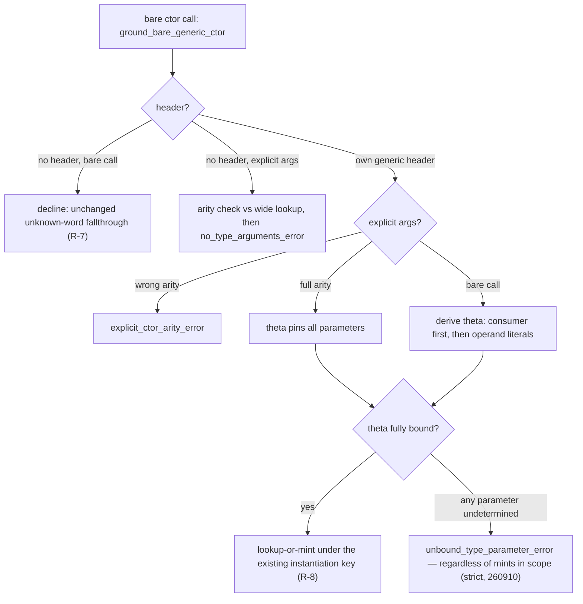

# P7b.S11 — per-call-site grounding for bare generic constructors

Condensed reference. Implemented on branch `soo-2` (base `486eda4`, phases 1–3 in
`99c210a`, `bb8ad59`, `30b9fac`); the delivery plan and its phase scaffolding have
been dropped in favour of the commit links below. Frozen round records — retained
as history, not superseded by this file: [slice11-brief](./slice11-brief.md)
(problem, mechanism, rulings R1–R7), [slice11-probes](./slice11-probes.md) (the
dp round, plus a post-implementation appendix recording the implemented
diagnostics verbatim), byte-exact stderr baseline `probes/dp_baseline.md`,
fixtures `probes/dp_*.sth`. The cross-module sibling is
[slice10-spec](./slice10-spec.md); this slice is the same-module counterpart and
is verified structurally separate from it.

## Ruling tags

Legend for the `R-x` tags cited in `src/check/terms.rs` comments (and below),
as of the **strict-grounding amendment (maintainer ruling, 260910)**:

- **R-1** — bare generic ctor calls re-ground at the resolve loop from call-site inputs, not the whole-module mint scan.
- **R-2** — θ inputs in precedence order (explicit type args > consumer constraints > operand literals); determined by use → ground, otherwise the located unbound-parameter error.
- **R-3** — *retired 260910*: the mint-as-candidate wildcard filter, the sole-compatible take, and the tie-break were replaced by strict grounding (a bare ctor call's parameters are never filled, disambiguated, or vetoed from module scope). The `header_mint_candidates` read survives only inside the category fence's identity check (are the pre-existing resolution's candidates this header's mints?), never touching parameter values.
- **R-4** — *retired 260910*: first-wins and the scope tie-break were replaced by strict grounding — the ambiguity error (2+ same-tier candidates, sorted by rendered string) and the incompatible-sole-mint error died with the scope consultation; order-stability now holds trivially because the outcome is a function of the call site alone.
- **R-5** — originally three located diagnostics (unbound parameter / incompatible sole mint / ambiguity); after the amendment only the **unbound-parameter** diagnostic survives (dp_c's bytes, unchanged).
- **R-6** — the explicit-args category: full arity, generic headers only, consumer-independent; a wrong-arity list is a located error.
- **R-7** — a genuinely undefined name keeps the unchanged `unknown word` error; zero-mints-of-a-known-header stays distinguishable from it.
- **R-8** — one monomorph per (word, θ): lookup-or-mint through the existing keyed instantiators (`mint_header_instantiation`), never a forked duplicate.

The full requirement text behind these tags lives in the pre-condensation spec
(git history, `261acdc`).

## Why

Bare generic constructor/destructure calls (`Ok`, `Err`, and enum/struct
generated words with a free type parameter) had **no per-call-site grounding**.
The checker env was built once from parse-time eager mints; a bare ctor call
missed `env` and fell to a whole-module monomorph registry scan
(`mint_fallback_candidates`) that had no call-site information. Four measured
defects (probe round, frozen in slice11-probes):

1. **Zero-mint misdiagnostic (dp_c).** `1 Ok drop` with no concrete `Res[...]`
   anywhere in the module produced the generic `unknown word` error,
   indistinguishable from a genuinely undefined name and blaming the wrong
   word rather than the unbound parameter `'E`.
2. **Wrong-mint forcing (dp_d).** A sole existing mint was taken unconditionally
   regardless of fit, failing later with a far-away operand mismatch that never
   mentioned grounding. The rejection was correct; the mechanism reaching it
   was accidental.
3. **Silent first-wins on ties (dp_g2/dp_g3).** With 2+ mints, the fallback
   selector took the first declared candidate with no ambiguity check: two
   programs differing only in unrelated declaration order constructed
   different runtime types from the same bare call. **A correctness gap, not a
   diagnostics gap.**
4. **No explicit-args category (dp_e/dp_e2).** `Ok[i64 i64]` was rejected by
   the type-args gate: only user-declared poly words and trait members admitted
   type args. No escape-hatch spelling existed, independent of grounding.

This is the silent load-bearing dependence the roadmap exists to turn into
sharp compile errors (CLAUDE.md). The slice is checker-stage only and has no
forcing dependency on P9; landing it ahead of P9.S2 keeps the alloc-layer brief
free of checker-grounding concerns.

## What shipped

### The grounding ladder

`ground_bare_generic_ctor` (`src/check/terms.rs`) intercepts bare ctor
calls at both sites where the pre-existing resolution used to decide from
mints alone: the zero-candidate `env.get`-miss arm and the chosen `[only]`
candidate arm. It derives a substitution θ for the header's type parameters
from three inputs, consumed in precedence order — the enduring semantic
contract, now **strict** per the maintainer ruling of 260910: *a bare
generic-ctor call must be groundable from its own information alone;
determined by use → ground, not determined → located error*:

1. **Explicit type args** (full arity) pin every parameter outright and return.
2. **Consumer constraints** — per ruling (A) (review round 1, 260909), a
   *monomorphic* consumer's signature pins θ statically at the site
   (dp_g2's `only_takes_cstr_err` pins both parameters), and a *poly*
   consumer's declared input resolves through its own `check_poly_call` route:
   the monomorph minted at the ctor site and the one the consumer resolves are
   one monomorph under the existing instantiation keying (R-8). Tail position
   reaches a third consumer, the enclosing word's declared output — the dp_a
   channel, and the only pin a zero-field variant constructor (`None`) can
   have. The amendment adds the spliced-body half of this same channel: inside
   a poly-combinator splice, running off the spliced body's term list means
   the *combinator's own declared output* (instantiated through the splice's
   substitution) consumes the body's result — the direct consumer, one step
   closer than the caller's outputs the tail channel reads. This is what keeps
   the `wrap inline ( 'T ~[ 'T -- 'T ] -- Result['T i64] ) call Ok` family
   and the HKT member arms grounding under strict rules; a call whose
   consumer was already determined upstream (explicit args, a poly consumer's
   own type arguments) is pinned before this fallback ever runs, and mono
   combinators carry no `combinator_sig` and decline byte-identically.
3. **Literal-driven partial inference** — operand types at the call site pin
   the leading *bare* header variables they cover; variables nested inside
   array/reference/cell shapes stay wildcards rather than risk a guessed
   (miscompiling) grounding.

Outcome on the θ derived — total, no scope fallback:

- **Fully bound** → ground directly, lookup-or-mint under the existing
  instantiation keying (R-8) — a zero-mint site can still succeed (G5, G9),
  and a competing mint is never borrowed (the args' instantiation is minted
  fresh).
- **Any parameter undetermined** by those three inputs → the located
  **unbound-parameter error** naming the parameter, its header position, and
  the remedy (dp_c's bytes, unchanged) — *regardless of what monomorphs exist
  in module scope*. The module's mint registry is never consulted to fill,
  disambiguate, or veto a bare ctor call's parameters: the wildcard filter,
  the sole-compatible take, the ambiguity error (dp_g's candidate list), and
  the incompatible-sole-mint error (dp_d's original text) are all retired
  with the scope consultation. A genuinely undefined name keeps the unchanged
  `unknown word` error (R-7) — the zero-mint/undefined split lives in the
  zero-candidate arm, which only routes names with a known generic header
  into the ladder.
- **Decline** (`None`) happens only where this name has no groundable
  own-module ctor header (a destructure, a foreign header, a length or
  higher-kinded parameter, two claimants), or the **category fence**
  preserves a same-named non-ctor candidate: with candidates in hand, S11
  only ever redirects a call the pre-existing resolution would itself have
  resolved to a monomorph of this header — a same-named user word, or another
  module's generated word, keeps its own resolution (the fence is an
  interception gate; it never reads or writes parameter values). The decline
  leaves the pre-existing selection — the S8b span-keyed pin and the S3
  splice redirect included — byte-for-byte as it was.

One settled deviation from the spec's advisory: the ambiguity tie-break was
placed **upstream in `ground_bare_generic_ctor`**, not inside
`select_overload_fallback_sourced` as the draft planned — the fence it needs
(own-module instantiations of one own header, which S5's tier 1 must keep
resolving in a *mixed* tie) is a fact about the call site's header, which an
`Overload` alone cannot express. `builtins.rs` gained only a doc update; the
selector's behavior is byte-identical (NFR-2). *(Retired with the strict
amendment, 260910: the tie-break itself is gone — scope is never consulted —
so the deviation is historical.)*

### Blast radius of the amendment (260910)

The strict rule is not purely subtractive. Four records beyond the dp probes,
all checked at the amendment:

- **One new consumer channel.** The `wrap inline … call Ok` family (P7
  slice-11 goldens 1/6/6b/9/dup/bind, the combinators.rs unit) and the HKT
  member arms grounded only through the retired scope borrow (the Part-1
  mint taken by the old decline+`[only]` path). Their consumer is — and
  semantically always was — the *spliced poly-combinator's declared output*;
  `consumer_expected_type` now reads it (instantiated through the splice's
  own substitution) as a fallback after the tail channel. Use-determination,
  no registry consultation; mono combinators and already-pinned calls are
  byte-identical.
- **Five fixtures rewritten** whose mechanism was precisely the retired
  sole-compatible scope borrow: the `reorder` family (phase7_slice3a T1/T2,
  the `unify_poly_input` unit in poly.rs, phase6_slice3b's eliminator twin)
  and P7 slice-11 golden 2's argument quotation now name their
  instantiations with explicit type args; each test's subject (positional
  unification symbols, `nm` symbols, stdout bytes, R1/R4 discrimination) is
  unchanged. dp_f-shaped *programs* are no longer accepted — an unused
  sibling's mint grounds nothing.
- **One acceptance→rejection delta beyond those five fixtures.** A bare ctor
  at the tail of an if-arm body nested inside a poly-combinator splice now
  rejects (verified: `wrap … | f | f call True ~[ drop 1 Ok ] ~[ drop 2 Ok ]
  if`) — row-based `if` has no poly sig, so the spliced-output channel is
  inert there; consistent with the ruling, previously silently grounded by
  the retired scope borrow.
- **The S9 pre-guard exemption stands.**
  `bare_generated_word_own_module_grounding` still derives ctor parameters
  from a foreign sole candidate's argument list in the
  same-named-foreign-header collision shape — a deliberate S9/S10-domain
  exemption preserved byte-identical by the slice's NFR; strictifying it is a
  separate future ruling, not part of this one.

### Explicit-args category (R-6)

`poly_call_takes_type_args` admits a third category: a bare generic
ctor/destructure name paired with a matching own header (a purely additive
disjunct; the two pre-existing categories are untouched). Full-arity validation
lives in the ladder, the single choke point both arms flow through: a
wrong-arity list is the located `explicit_ctor_arity_error` (count, plural,
header spelling and parameter names interpolated); a list the ladder declines
keeps the pre-S11 `no_type_arguments_error` — never a silent drop. Concrete
headers are excluded ("generic"); no parse-side change was needed (dp_e's
frozen baseline shows full-arity args reaching the checker intact). The
dp_e2 open question resolved as the spec predicted: explicit args ground with
no consumer at all, and a value the word then forgets reaches the ordinary
forgetting check (probe appendix).

### Fences

- **Checker-stage only (NFR-1, verified at condensation):** no diff in
  `src/ir`, `src/parser.rs`, or `src/emit` since `486eda4`; code changes are
  confined to `src/check/terms.rs` (ladder) and `src/check/builtins.rs` (doc
  only), plus tests and roadmap docs. The byte-level "zero IR diff" fence of
  the draft was retired during recon; behavior is the operative guarantee.
- **Non-regression (NFR-2/4):** S10's diagnostics byte-identical (S10 suite
  17/0, G8); S5's declared-overload tier policy, S2-9 member dispatch, S9's
  single-candidate pre-guard (which still runs ahead of the ladder), and
  dp_a/dp_b behaviors byte-identical to baseline (G6) — dp_f was accepted at
  baseline and is, per the strict amendment (260910), the unbound-parameter
  error (documented delta, not a regression).

## Goldens

`tests/phase7b_slice11.rs` — 14 goldens under the strict-grounding amendment
(260910, plus the wrap/if-arm blast-radius golden). Full error bytes are
pinned at G1/G2/G3 and the wrap/if-arm golden (measure-then-pin); dp_f and
dp_h pin a located error prefix plus cross-order byte-equality, not the full
trailing note text:
G1 (dp_c unbound-parameter, bytes unchanged), G2 (dp_d, now the
unbound-parameter error naming `'E` — the operand pins `'T`, scope is never
consulted), G3 (dp_g, now the unbound-parameter error, byte-identical across
declaration orders), G4 (dp_e explicit args run clean), G5 (poly-consumer
grounding), G9 (dp_g2/dp_g3 both orders, runtime-output proof), G7 (undefined
name keeps `unknown word`), dp_h (mint declared after the caller: both orders
now the *same unbound-parameter error bytes*), dp_f (moved out of the
accepting sweep: an unused sibling's mint grounds nothing — unbound-parameter
error), the dp_e2 shapes, wrong-arity, the accepting-shape sweep (dp_a/dp_b),
and a zero-sibling fully-bound golden (1-param `Opt['T]`, operand-pinned,
no mints in scope, grounds and runs), plus the wrap/if-arm blast-radius golden
(the acceptance→rejection delta: a bare ctor at an if-arm tail inside a poly
splice is the unbound-parameter error). Non-regression baseline:
`probes/dp_baseline.md`.

G5's implemented shape (corrected at review round 1, 260910; the spec row was
patched in-commit by `99c210a` and the roadmap Exit line mirrored it in
`30b9fac`): `1 Ok [ 1 add ] apply2[i64 i64] .` with poly consumer
`apply2 ( Res['T 'E] [ i64 -- i64 ] -- i64 )` — accepted via consumer-driven
grounding (the consumer's explicit args pin both parameters), runs, output
`42`. The originally-proposed `map[i64 i64 i64]` shape is not declarable at
this base: it hits the pre-existing `poly_generic_not_yet_groundable_error`
(`poly.rs:11138`), a pre-S11 poly-word refusal, not a grounding gap.

## Deferred (genuinely open)

- **Prefix-pinned ctor type args** (`Ok[i64]` meaning `Ok[i64 'E]`) — out of
  scope; needs its own probe if ever wanted.
- ~~**2+ mints, none compatible at the θ-bound positions** — the ladder
  declines and the call keeps the pre-S11 `no_overload_matches_error`; no
  dedicated incompatible-grounding diagnostic for this case (probe appendix
  P2 record).~~ **Retired 260910**: moot under strict grounding — scope is
  never consulted, so a bare ctor with an undetermined parameter is the
  unbound-parameter error whatever the mints.
- **Length-parameterized headers** keep the baseline rejection wholesale —
  `ctor_grounding_header` grounds length-free headers only.
- **S9 pre-guard collision corner:** in the struct-ctor/foreign-mint corner the
  pre-guard resolves the single-candidate site at the caller's own header
  *before* the ladder's arity validation runs, so a wrong-arity explicit-args
  list there surfaces the pre-guard's outcome rather than R-6's arity text.
- **Poly words grounding explicit args** (the `map[i64 i64 i64]` shape) —
  blocked by the pre-existing `poly_generic_not_yet_groundable_error`; revisit
  when poly words ground explicit args.
- **Proposed `src/check/ctor_grounding.rs` split** — recorded in `30b9fac`'s
  growth-signal re-run (terms.rs at 1/5 signals, below the 2-signal bar);
  re-run after the strict amendment (260910): terms.rs *shrank* by ~100 lines
  (the retired filter/ambiguity machinery and two diagnostics deleted) and
  still measures 1/5 signals — the grounding cluster remains the only
  candidate; cut the module when a second signal fires.
- **Decline-path coverage gaps** (bb8ad59 review P2): the right-arity
  destructure, name-collision fence, and foreign-header decline shapes are
  unpinned by tests — deferred (260909); the fence's bare decline survives
  the amendment (it gates interception, never parameters) so these gaps
  stand.

*(Also retired 260910: the unreachable-decline defense-in-depth note from
`bb8ad59` — the residual `Ok(None)` arms it catalogued are gone with the
scope-consultation machinery; the only surviving declines are the category
fence and the no-header gate — the gate is unit-pinned, the fence's
collision decline remains unpinned per the coverage-gaps bullet above.)*

## Implementation

| Area | Commit | Key symbols / files |
| --- | --- | --- |
| Checker grounding core — ladder, θ derivation, the located unbound-parameter diagnostic, unknown-word split | `99c210a` | `ground_bare_generic_ctor`, `derive_ctor_theta`, `consumer_expected_type`, `header_mint_candidates`, `mint_header_instantiation`, `ground_ctor_overload`, `unbound_type_parameter_error` (`src/check/terms.rs`); `select_overload_fallback_sourced` doc update (`src/check/builtins.rs`); spec G5-row correction in-commit. *260910 amendment:* `incompatible_grounding_error`/`ambiguous_grounding_error` and the scope-filter machinery deleted; `consumer_expected_type` gained the spliced-poly-output fallback |
| Explicit-args category | `bb8ad59` | third `poly_call_takes_type_args` category, `explicit_args_ctor_header`, `explicit_ctor_arity_error` (`src/check/terms.rs`) |
| Non-regression sweep + docs | `30b9fac` | 11-probe baseline sweep; post-implementation appendix (`docs/roadmap/P7b/slice11-probes.md`); roadmap S11 entry marked landed, Exit line corrected to the `apply2` shape (`docs/roadmap/P7b-higher-kinded-types.md`); dp_h golden |
| Goldens + units | `99c210a` + `bb8ad59`, dp_h in `30b9fac` | goldens in `tests/phase7b_slice11.rs`: 7 at `99c210a`, 10 by `bb8ad59`, dp_h at `30b9fac`, +2 by the strict-grounding amendment, +1 wrap/if-arm follow-up (14 at HEAD); units beside the changed sites (`src/check/terms.rs`) re-partitioned 5-out/3-in at the amendment, including the mid-check-mint dedup unit (R-8) and the span-keyed-pin survivor units |

Final gate verified at condensation time (HEAD `30b9fac`): `cargo fmt --check`
green; full `cargo test` 3390 passed / 0 failed; slice11 suite 11/11.
