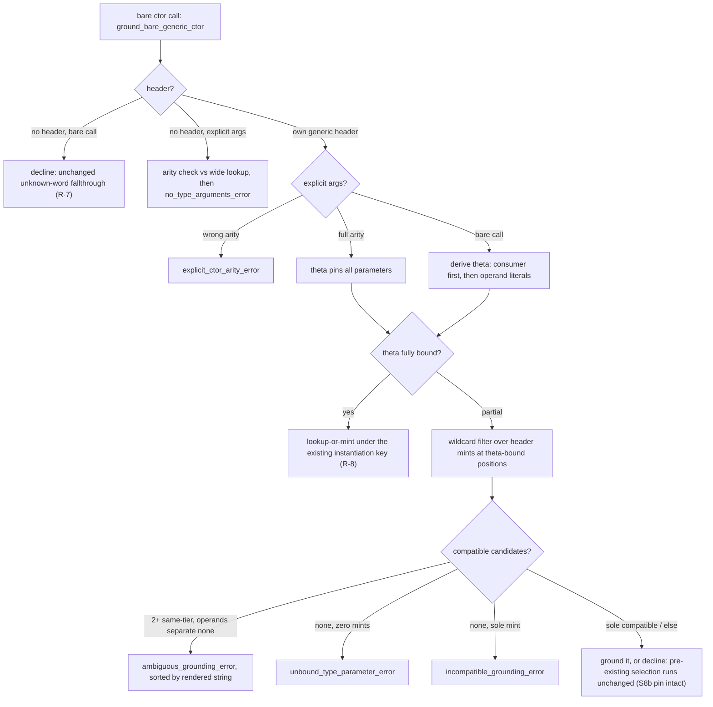

# P7b.S11 — per-call-site grounding for bare generic constructors

Condensed reference. Implemented on branch `soo-2` (base `486eda4`, phases 1–3 in
`99c210a`, `bb8ad59`, `30b9fac`); the delivery plan and its phase scaffolding have
been dropped in favour of the commit links below. Frozen round records — retained
as history, not superseded by this file: [slice11-brief](./slice11-brief.md)
(problem, mechanism, rulings R1–R7), [slice11-probes](./slice11-probes.md) (the
dp round, plus a post-implementation appendix recording the implemented
diagnostics verbatim), byte-exact stderr baseline `probes/dp_baseline.md`,
fixtures `probes/dp_*.sth`. The cross-module sibling is
[slice10-spec](./slice10-spec.md); this slice is the same-module counterpart and
is verified structurally separate from it.

## Why

Bare generic constructor/destructure calls (`Ok`, `Err`, and enum/struct
generated words with a free type parameter) had **no per-call-site grounding**.
The checker env was built once from parse-time eager mints; a bare ctor call
missed `env` and fell to a whole-module monomorph registry scan
(`mint_fallback_candidates`) that had no call-site information. Four measured
defects (probe round, frozen in slice11-probes):

1. **Zero-mint misdiagnostic (dp_c).** `1 Ok drop` with no concrete `Res[...]`
   anywhere in the module produced the generic `unknown word` error,
   indistinguishable from a genuinely undefined name and blaming the wrong
   word rather than the unbound parameter `'E`.
2. **Wrong-mint forcing (dp_d).** A sole existing mint was taken unconditionally
   regardless of fit, failing later with a far-away operand mismatch that never
   mentioned grounding. The rejection was correct; the mechanism reaching it
   was accidental.
3. **Silent first-wins on ties (dp_g2/dp_g3).** With 2+ mints, the fallback
   selector took the first declared candidate with no ambiguity check: two
   programs differing only in unrelated declaration order constructed
   different runtime types from the same bare call. **A correctness gap, not a
   diagnostics gap.**
4. **No explicit-args category (dp_e/dp_e2).** `Ok[i64 i64]` was rejected by
   the type-args gate: only user-declared poly words and trait members admitted
   type args. No escape-hatch spelling existed, independent of grounding.

This is the silent load-bearing dependence the roadmap exists to turn into
sharp compile errors (CLAUDE.md). The slice is checker-stage only and has no
forcing dependency on P9; landing it ahead of P9.S2 keeps the alloc-layer brief
free of checker-grounding concerns.

## What shipped

### The grounding ladder

`ground_bare_generic_ctor` (`src/check/terms.rs`) now intercepts bare ctor
calls at both sites where the pre-existing resolution used to decide from
mints alone: the zero-candidate `env.get`-miss arm and the chosen `[only]`
candidate arm. It derives a substitution θ for the header's type parameters
from three inputs, consumed in precedence order — the enduring semantic
contract:

1. **Explicit type args** (full arity) pin every parameter outright and return.
2. **Consumer constraints** — per ruling (A) (review round 1, 260909), a
   *monomorphic* consumer's signature pins θ statically at the site
   (dp_g2's `only_takes_cstr_err` pins both parameters), and a *poly*
   consumer's declared input resolves through its own `check_poly_call` route:
   the monomorph minted at the ctor site and the one the consumer resolves are
   one monomorph under the existing instantiation keying (R-8). Tail position
   reaches a third consumer, the enclosing word's declared output — the dp_a
   channel, and the only pin a zero-field variant constructor (`None`) can
   have.
3. **Literal-driven partial inference** — operand types at the call site pin
   the leading *bare* header variables they cover; variables nested inside
   array/reference/cell shapes stay wildcards rather than risk a guessed
   (miscompiling) grounding.

Outcome on the θ derived:

- **Fully bound** → ground directly, lookup-or-mint under the existing
  instantiation keying — a zero-mint site can still succeed (G5, G9), and a
  competing mint is never borrowed (the args' instantiation is minted fresh).
- **Partially bound** → wildcard-compatibility filter over existing mints at
  every θ-bound position (R-3: mints are candidates, not verdicts). Unbound
  positions are wildcards; a sole compatible mint binds the remaining
  parameters from itself (dp_f, unit-pinned).
- **Failure**, by case (the spec's error precedence — ambiguity >
  incompatible-grounding > unbound-parameter — maps onto disjoint mint-count
  cases): 2+ same-tier compatible candidates the operands do not separate →
  located **ambiguity error**, tied types listed sorted by rendered string so
  the text is stable across declaration orders (dp_g, NFR-3); a sole mint
  mismatching at a *bound* position → located **incompatible-grounding error**
  naming expected vs mint (dp_d); zero mints with an undetermined parameter →
  located **unbound-parameter error** naming the parameter, its header
  position, and the remedy (dp_c). A genuinely undefined name keeps the
  unchanged `unknown word` error (R-7) — the zero-mint/undefined split lives
  in the zero-candidate arm, which only routes names with a known generic
  header into the ladder.
- **Decline** (`None`) leaves the pre-existing selection — the S8b span-keyed
  pin and the S3 splice redirect included — byte-for-byte as it was, which is
  also the disposition for a sole compatible candidate at a non-zero-candidate
  site (it is the one the `[only]` arm would have taken anyway). The
  take-the-sole-mint arm at zero-candidate sites is documented in-tree as
  currently unreachable; dp_f's real flow is decline plus that pre-existing
  take, outcome identical.

One settled deviation from the spec's advisory: the ambiguity tie-break was
placed **upstream in `ground_bare_generic_ctor`**, not inside
`select_overload_fallback_sourced` as the draft planned — the fence it needs
(own-module instantiations of one own header, which S5's tier 1 must keep
resolving in a *mixed* tie) is a fact about the call site's header, which an
`Overload` alone cannot express. `builtins.rs` gained only a doc update; the
selector's behavior is byte-identical (NFR-2).

### Explicit-args category (R-6)

`poly_call_takes_type_args` admits a third category: a bare generic
ctor/destructure name paired with a matching own header (a purely additive
disjunct; the two pre-existing categories are untouched). Full-arity validation
lives in the ladder, the single choke point both arms flow through: a
wrong-arity list is the located `explicit_ctor_arity_error` (count, plural,
header spelling and parameter names interpolated); a list the ladder declines
keeps the pre-S11 `no_type_arguments_error` — never a silent drop. Concrete
headers are excluded ("generic"); no parse-side change was needed (dp_e's
frozen baseline shows full-arity args reaching the checker intact). The
dp_e2 open question resolved as the spec predicted: explicit args ground with
no consumer at all, and a value the word then forgets reaches the ordinary
forgetting check (probe appendix).

### Fences

- **Checker-stage only (NFR-1, verified at condensation):** the full branch
  diff vs `486eda4` touches exactly `src/check/terms.rs` and
  `src/check/builtins.rs` (the latter +13 doc lines) — no `src/ir`,
  `src/parser.rs`, or `src/emit` change. The byte-level "zero IR diff" fence of
  the draft was retired during recon; behavior is the operative guarantee.
- **Non-regression (NFR-2/4):** S10's diagnostics byte-identical (S10 suite
  17/0, G8); S5's declared-overload tier policy, S2-9 member dispatch, S9's
  single-candidate pre-guard (which still runs ahead of the ladder), and
  dp_a/dp_b/dp_f behaviors byte-identical to baseline (G6).

## Goldens

`tests/phase7b_slice11.rs` — 11 goldens, byte-exact on error text:
G1 (dp_c unbound-parameter), G2 (dp_d expected-vs-mint), G3 (dp_g ambiguity,
byte-identical across declaration orders), G4 (dp_e explicit args run clean),
G5 (poly-consumer grounding), G9 (dp_g2/dp_g3 both orders, runtime-output
proof), G7 (undefined name keeps `unknown word`), dp_h (mint declared after
the caller grounds the call, both orders — added in phase 3), the dp_e2
shapes, wrong-arity, and the accepting-shape sweep. Non-regression baseline:
`probes/dp_baseline.md`.

G5's implemented shape (corrected at review round 1, 260910; the spec row was
patched in-commit by `99c210a` and the roadmap Exit line mirrored it in
`30b9fac`): `1 Ok [ 1 add ] apply2[i64 i64] .` with poly consumer
`apply2 ( Res['T 'E] [ i64 -- i64 ] -- i64 )` — accepted via consumer-driven
grounding (the consumer's explicit args pin both parameters), runs, output
`42`. The originally-proposed `map[i64 i64 i64]` shape is not declarable at
this base: it hits the pre-existing `poly_generic_not_yet_groundable_error`
(`poly.rs:11138`), a pre-S11 poly-word refusal, not a grounding gap.

## Deferred (genuinely open)

- **Prefix-pinned ctor type args** (`Ok[i64]` meaning `Ok[i64 'E]`) — out of
  scope; needs its own probe if ever wanted.
- **2+ mints, none compatible at the θ-bound positions** — the ladder declines
  and the call keeps the pre-S11 `no_overload_matches_error`; no dedicated
  incompatible-grounding diagnostic for this case (probe appendix P2 record).
- **Length-parameterized headers** keep the baseline rejection wholesale —
  `ctor_grounding_header` grounds length-free headers only.
- **S9 pre-guard collision corner:** in the struct-ctor/foreign-mint corner the
  pre-guard resolves the single-candidate site at the caller's own header
  *before* the ladder's arity validation runs, so a wrong-arity explicit-args
  list there surfaces the pre-guard's outcome rather than R-6's arity text.
- **Poly words grounding explicit args** (the `map[i64 i64 i64]` shape) —
  blocked by the pre-existing `poly_generic_not_yet_groundable_error`; revisit
  when poly words ground explicit args.
- **Proposed `src/check/ctor_grounding.rs` split** — recorded in `30b9fac`'s
  growth-signal re-run (terms.rs at 1/5 signals, below the 2-signal bar); cut
  the module when a second signal fires.

## Implementation

| Area | Commit | Key symbols / files |
| --- | --- | --- |
| Checker grounding core — ladder, θ derivation, three located diagnostics, unknown-word split | `99c210a` | `ground_bare_generic_ctor`, `derive_ctor_theta`, `consumer_expected_type`, `header_mint_candidates`, `mint_header_instantiation`, `ground_ctor_overload`, `unbound_type_parameter_error`, `incompatible_grounding_error`, `ambiguous_grounding_error` (`src/check/terms.rs`); `select_overload_fallback_sourced` doc update (`src/check/builtins.rs`); spec G5-row correction in-commit |
| Explicit-args category | `bb8ad59` | third `poly_call_takes_type_args` category, `explicit_args_ctor_header`, `explicit_ctor_arity_error` (`src/check/terms.rs`) |
| Non-regression sweep + docs | `30b9fac` | 11-probe baseline sweep; post-implementation appendix (`docs/roadmap/P7b/slice11-probes.md`); roadmap S11 entry marked landed, Exit line corrected to the `apply2` shape (`docs/roadmap/P7b-higher-kinded-types.md`); dp_h golden |
| Goldens + units | `99c210a` + `bb8ad59` | 11 goldens in `tests/phase7b_slice11.rs`; 21 units beside the changed sites (`src/check/terms.rs`), including the mid-check-mint dedup unit (R-8) and the span-keyed-pin survivor units |

Final gate verified at condensation time (HEAD `30b9fac`): `cargo fmt --check`
green; full `cargo test` 3390 passed / 0 failed; slice11 suite 11/11.
