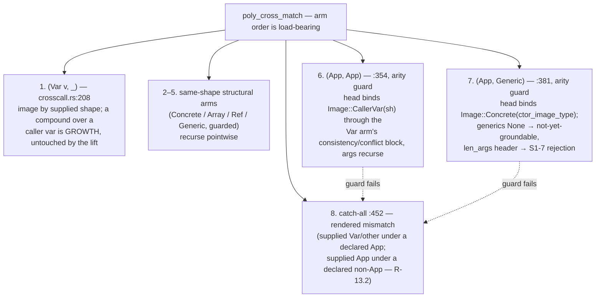

# P7b.S13 spec — cross-call App lift (SOO-60)

**Status: Implemented** (branch `soo-60`, base `a3779f4`; phases `242e547`,
`8ff4065`, `e3c7799`). Reference documentation — the full delivery-plan spec
is preserved in git history before commit `242e547`. Discovery remains ground
truth: [slice13-probes](./slice13-probes.md) and
[slice13-paper-tests](./slice13-paper-tests.md) (frozen baseline
`probes/s13_baseline.md`).

## What was done and why

Two located fences in `src/check/poly/crosscall.rs` rejected poly→poly
cross-calls over higher-kinded shapes: the input fence (S1-17.i) matched
`(App{..}, _) | (_, App{..})` two-sidedly and refused any App slot on either
side of an INPUT match, and `poly_cross_output`'s wildcard refused every
compound OUTPUT the same way. This was the remaining facet of the roadmap
sentence "poly bodies calling poly words over compound receivers" — S12
(SOO-39) had fixed member dispatch; poly-word self-calls were always fine
(structural pointwise match). The lift removes both fences so an App-headed
cross-call checks, grounds, and lowers through the same machinery the mono
route already uses — with **no new `Image` or `PolyType` variant, no new
unification rule, and no new grounding or lowering code**.

Key decisions, as shipped:

- **Guarded declared-App arms; the replacement shape was pinned.** The input
  fence became two arms — `(App, App)` and `(App, Generic)` — each carrying
  its arity test as a match guard, so a guard failure reaches the unchanged
  `_ => Err(mismatch())` catch-all (`crosscall.rs:452`), the same mechanism
  the same-header Generic/Generic guard's failure already takes. The spec
  pinned the guarded arms (an arm body cannot "fall through"; the
  alternative — an inline `Err(mismatch())` for unmatched sub-shapes — is a
  byte-identical outcome) so the implementation would not choose.
- **R-13.1: a concrete ctor supplied as the head binds a ctor image.** The
  `(App, Generic)` arm binds the callee's head variable to
  `Image::Concrete(ctor_image_type(&generics, gid-of-the-supplied-header))` —
  the same `CtorImage` binding the mono route's App arm inserts, so the
  cross-call route is exactly as strong as the mono route for the identical
  shape. REJECTED: the rendered mismatch — it would have made the twin
  spellings diverge (`'It['T]` green while `Wrap['T]` stayed red) with no
  kind-level difference, and made the cross-call route strictly weaker than
  the mono route (which grounds `'It:=Wrap` clean). The bind READS the
  generics registry (`ctor_image_type` reads the ctor's declared name off
  it); the walk-time "no registry interning" claim is about interning only —
  interning happens at grounding. Two no-new-text postures inside the arm:
  `ctx.generics() == None` reuses `poly_generic_not_yet_groundable_error`
  (the mono precedent), and a supplied header carrying `len_args` takes the
  mono route's S1-7 rejection `poly_app_len_domain_unsupported_error` —
  checked in the arm body, because as a match guard it could only reach the
  catch-all mismatch, and it is a distinct diagnostic.
- **R-13.2: the second fence pattern is deleted, deliberately unpinned.** A
  supplied App against a declared non-App slot falls to the catch-all
  mismatch — except a declared bare Var, whose arm precedes everything and
  keeps GROWTH. The round-G inventory had no fixture for this face, so it
  shipped unpinned; a named rejection there would have been a third
  diagnostic, outside the slice's no-new-text posture. The face has a unit
  since implementation
  (`poly_cross_match_supplied_app_against_declared_non_app_is_a_mismatch`).
- **R-13.3: G12 verifies bound discharge over a ctor-image head — the
  slice's one user-ratified addition.** The lift adds no machinery: the
  walk-time `Bound::Copy` arm degrades honestly (`is_copy(CtorImage)` is
  false, `builtins.rs:560`), and a `Bound::User` on a ctor-image head defers
  to compose's `resolve_user_bound` loop with `ty = CtorImage`. That path
  had no golden when the spec was written, so G12 was made REQUIRED: the
  Cursor-bounded App pass-through pair (S12's former fence fixture,
  byte-verbatim) plus a spelled grounding main (`Opt['X]`, a `Cursor for
  Opt` impl, `: main ( -- ) 42 43 Some outer drop ;`), fixture and bytes
  pinned from the live binary. The implementation-time probe observed the
  compose loop firing with `ty = CtorImage(Opt)`; dropping the impl makes
  the mono site reject, so the golden rides bound discharge.
- **R-13.4: overload candidate selection unchanged by design.**
  `poly_cross_call`'s first-match-wins trial (`crosscall.rs:29`) now admits
  App-declared candidates instead of fence-skipping them; ranking still has
  no ground type to key on, so declaration order decides exactly as before
  the lift. The non-App ambiguity canary
  (`a_cross_call_through_an_overloaded_generic_word_is_a_located_rejection`,
  `tests/phase7_slice3k.rs:326`) is the only related pin and stays green.
- **Output arms render structurally through the mapping.** `poly_cross_output`
  gains `Generic`, `Array`, and `App` arms before the wildcard, every nested
  variable through one shared lookup — `poly_cross_output_image`, split out
  of the bare-Var arm so the compound arms and the Var arm cannot drift.
  The Generic header passes through identity-unchanged (it is the header's
  identity, not something the mapping substitutes); an App head whose image
  is a `CtorImage` rebuilds the Generic with `len_args: vec![]` (an App head
  supplies type arguments only; the signature gate
  `poly_cross_signature_supported` fences length variables upstream), and a
  non-CtorImage `Concrete` head guards to the rendered mismatch (unreachable
  per round F — guarded, not assumed). **Ref gains no arm** (banned at
  declaration — "a reference cannot be stored"; the wildcard's Ref face is
  unreachable and stays as defense), and **GenericVariant stays in the
  wildcard** (the R3.4/R3.5 convention).
- **The growth ban is untouched — precedence is the invariant.** The
  `(PolyType::Var(v), _)` arm (`crosscall.rs:208`) and its supplied-match
  are unedited: the diff against `a3779f4` starts at the fence line. An App
  operand facing a bare-var declared input stays the GROWTH error — never
  the (deleted) fence, never a bind (round B2). Unit pins:
  `check_growing_cross_call_is_error` (`src/check/poly/tests.rs:4349`) and
  `a_cross_call_growing_the_type_is_a_located_rejection`
  (`tests/phase7_slice3k.rs:195`).
- **The `ast.rs` change is comment-only.** The `Image` doc comment ("no type
  constructor ever needs representing here") went stale with the lift; it
  now records `Type::CtorImage` as the one constructor an image can carry.
  `ctor_image_type` remains the sole constructor; no behavior change.

One accepted limitation, recorded: `poly_image_str` renders a concrete image
through `Type::name`, which returns the bare ctor name — two same-named
ctors from different modules render identically in
`poly_cross_var_conflict_error` text. Diagnostic-only, no unsoundness;
follow-up candidate.

Input dispatch, as shipped (the arm order is the load-bearing part):

Grounding and lowering needed nothing new: compose (`instantiate.rs:682`)
folds the mapping into θ_h, `apply_subst` (`unify.rs:598`) grounds the
callee's outputs — the registries intern array/ref/cell shapes and mint
Generic/GenericVariant/App there, not at walk time. Lowering keeps its
App-head-CtorImage invariant assert (`src/ir/driver.rs:708-711`).

### Growth-signal re-check (phase exit)

Re-run on `crosscall.rs` as it now stands (780 lines): 0/5 house signals —
no split. Recorded non-signal observations: the head-bind
consistency/conflict block appears three times (Var arm inline, the two
input arms as its verbatim twins, by design), and the output render arms
mirror the match dispatch.

## Implementation

- **Input arms (REQ-1/2/3)**: `242e547` — `src/check/poly/crosscall.rs`:
  the two guarded arms (`(App, App)` :354, `(App, Generic)` :381-451), the
  second fence pattern deleted (R-13.2), catch-all kept :452, Var/growth
  arm :208 untouched. Retargets: `src/check/poly/tests.rs` :610
  `non_member_app_cross_call_checks_clean_after_the_lift` (flipped green)
  and :1774 `poly_cross_match_app_slot_vs_bare_var_is_a_rendered_mismatch`
  (G5); `tests/phase7b_slice12.rs` :435
  `cross_call_app_slot_checks_clean_after_the_hkt_lift` (S12's byte-pin →
  green Ok, `build_error_bare` moved out). Nine input-arm units
  (`src/check/poly/tests.rs:1842-2120`: head+arg bind, concrete-arg bind,
  ctor-image bind, not-yet-groundable, len-domain rejection, arity
  mismatch, head conflict, the R-13.2 face, the G5 twin).
  `tests/phase7b_slice13.rs` created with the `build_error_bare` copy
  (:163) — G2 (:190) and G5 (:218) its first goldens. Suite 3538/0 per the
  commit message.
- **Output arms (REQ-4/6)**: `8ff4065` — `poly_cross_output` (:470) gains
  the `Array` (:486), `Generic` (:494), and `App` (:522) arms over the
  shared `poly_cross_output_image` helper (:597); `pub(super)` for
  direct-call units; `src/ast.rs` Image doc comment (comment-only, :3004).
  G10.3 retargeted in place: sub-fixture 2 of
  `check_cross_call_unsupported_callee_shapes_name_themselves`
  (`src/check/poly/tests.rs:4537`) flipped green — the poly-body-drop twin
  of G7; sub-fixtures 1/3 byte-identical. Six output-arm units
  (:2159-2331). Goldens G1/G3/G4/G6/G7/G8. Suite 3550/0 per the commit
  message.
- **G12 + docs**: `e3c7799` — golden
  `cursor_bounded_app_pass_through_grounds_end_to_end`
  (`tests/phase7b_slice13.rs:413`); `docs/roadmap/ROADMAP.md` aggregate P7b
  row amended (P7b.S13 landed; the SOO-60 deferral annotated as landed);
  new P7b.S13 section in `docs/roadmap/P7b-higher-kinded-types.md` (:800).
  Suite 3551/0 per the commit message; re-verified live this round (fmt +
  clippy clean, 3551 passed / 0 failed).

### Tests — the G1–G12 goldens

All goldens live in `tests/phase7b_slice13.rs` (9 test functions; G9, G10,
G11 are covered by other pins as noted). Harness: `single_file_hosted` /
`build_run_keep` / `build_ok` / `build_error_located` conventions from
`tests/phase7b_slice8.rs`, plus the `build_error_bare` copy (byte-verbatim
source in a bare temp dir, so line numbers match the frozen baseline).

| Golden | Test | Pins |
| --- | --- | --- |
| G1 | `app_pass_through_cross_call_builds_and_runs_clean` (:253) | `probes/s13_e_post_lift_green.sth` verbatim; exit 0, stdout empty |
| G2 | `bare_var_supplied_app_operand_still_grows_byte_identically` (:190) | `probes/s13_b_bare_var_growth.sth` verbatim via `build_error_bare`; growth bytes byte-identical to `probes/s13_baseline.md` (REQ-3 must-not-move) |
| G3 | `app_vs_app_head_and_arg_vars_both_bind` (:283) | edited D1; exit 0 |
| G4 | `app_vs_app_concrete_arg_grounds_the_element` (:305) | edited D2 (`'It[i64]`); exit 0 |
| G5 | `bare_var_supplied_where_app_declared_is_a_rendered_mismatch` (:218) | `probes/s13_d_bare_supplied.sth` verbatim; the one verdict that MOVED (fence → rendered mismatch), bytes pinned from the live binary |
| G6 | `concrete_ctor_supplied_as_head_binds_the_ctor_image` (:330) | edited D4 (R-13.1); exit 0 |
| G7 | `generic_output_renders_through_the_mapping` (:358) | edited C2; exit 0 |
| G8 | `array_output_renders_through_the_mapping` (:382) | edited C4; `build_ok` |
| G9 | — | the mechanism walkthrough documented on G1 (input arm step 2, output arm step 3, compose/apply_subst steps 4–5); covered by G1 |
| G10 | — | the four moved-pin retargets (all green; listed under Implementation) |
| G11 | — | the full suite: 3551 passed / 0 failed, fmt + clippy clean (re-verified this round) |
| G12 | `cursor_bounded_app_pass_through_grounds_end_to_end` (:413) | the G10.4 source + spelled grounding main; R-13.3's compose path with `ty = CtorImage`; exit 0, stdout empty |
