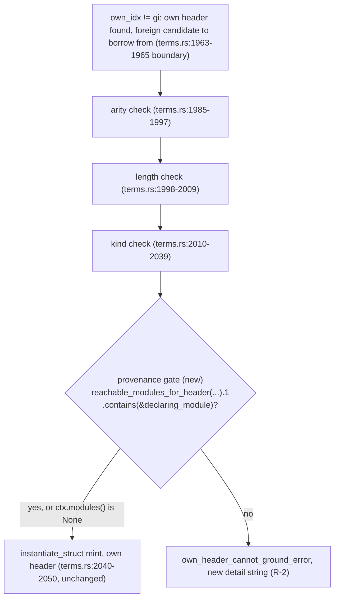

# P7b.S14 — provenance-gate the S9 pre-guard's scope-derived ctor params (SOO-58)

Delivery plan. Source: SOO-58 (a P7b.S11 open ruling question), decided via two
rounds of interview 2026-09-13 (full record on the SOO-58 Linear comment; the
second round narrowed the ruling below after a 3-reviewer round found the
original "verbatim S10 reuse" ruling unsound). Discovery ground truth:
[slice14-brief](./slice14-brief.md) (superseded on the ruling; its blast-radius
facts still hold). Sibling slices: [slice10-spec](./slice10-spec.md) (the
headerless-caller reachability gate this slice partially reuses) and
[slice11-spec](./slice11-spec.md) (whose "S9 pre-guard exemption stands" bullet
this slice supersedes).

## The residual, in one sentence

`bare_generated_word_own_module_grounding` (the S9 pre-guard,
`src/check/terms.rs:1879-2064`) fires on a bare ctor call that resolves to the
caller's *own* struct/enum header. When the only same-named env candidate is a
foreign module's eager mint, the pre-guard borrows **that candidate's
type-argument list** to instantiate the caller's own header — with **no
reachability check at all**. The sibling shape (headerless caller,
`foreign_single_candidate_grounding`, `terms.rs:2086-2178`) gates the identical
foreign-arg borrow behind an import-reachability walk; the own-header shape does
not. S11 recorded this as a deliberate exemption ("The S9 pre-guard exemption
stands", slice11-spec §Blast radius). This slice retires that exemption.

`mint_fallback_candidates` (`terms.rs:2433`) scans the **whole-program** live
generic-mint registry — every struct/enum/variant mint made anywhere in the
compiled program, not anything scoped by the caller's import graph. So the
foreign argument list the pre-guard borrows can come from a module the caller
never imports and cannot name. Grounding the caller's own header against it is
sound on *shape* (arity, length and kind are already validated,
`terms.rs:1985-2039`) but unprincipled on *provenance*: the caller silently
depends on a module outside its own import closure to decide its ctor's type
arguments.

## Ruling (decided, not open)

**Add a provenance-only reachability check to the S9 pre-guard's foreign-arg
borrow — not S10's gate applied verbatim.** The check is: the foreign
candidate's declaring module must be reachable through the caller's own import
set (plain imports, selective imports, or a resolved hub re-export chain),
otherwise the borrow is refused and the call is a located error. This reuses
**only** the reachability-walk half of `foreign_single_candidate_grounding`'s
logic (the `reachable: HashSet<u32>` construction, `terms.rs:2110-2129`).

It deliberately **omits** the other half — the `reachable_declaring.len() <= 1`
ambiguity-count clause (`terms.rs:2136-2139`) and exemption 4's named-selective
tie-break (`terms.rs:2140-2155`), both of which exist to answer "which header do
I pick when several are reachable?". That question does not exist on the
own-header path: the header is never in question (it is the caller's own,
already selected before this gate runs); only the borrowed *argument list*'s
provenance is. Applying the ambiguity clause anyway would reject calls whose
header choice was never ambiguous, which is exactly the defect the first
spec draft had (see below).

**Why not verbatim reuse (first-round ruling, retracted):** three independent
reviewers found that applying S10's full gate, including the ambiguity clause,
breaks an existing, load-bearing invariant. `own_header_still_grounded_first`
(`terms.rs:5812`, doc comment at `:5808-5811`) asserts "the caller's own header
grounds the call before any exemption runs... no matter how many foreign
same-named headers its imports can reach." Under the full S10 gate, a caller
with 2+ reachable foreign same-named headers would hit
`ambiguous_generic_headers_error` even though its own header was never in
doubt — inverting that unit's own assertion. The narrowed gate below keeps this
unit passing unchanged (traced below).

### Verification: the narrowed gate preserves `own_header_still_grounded_first`

The unit's fixture: caller module 3 owns a `Widget` header; modules 4 and 5 also
declare `Widget`; the borrowed mint belongs to module 4; the caller's
`ModuleInfo` imports both (`a`→4, `b`→5). Tracing the narrowed gate: `declarers
= {3, 4, 5}` (all three `Widget`-declaring modules); `raw = {4, 5}` (the
caller's import targets); `reachable = {4, 5}` (both are already declarers, so
`walk_generic_header_origin` returns each immediately). The narrowed gate checks
only `reachable.contains(&declaring_module)` where `declaring_module == 4` —
true — so the borrow is permitted and the unit's `Ok(Some(..))` /
`grounded.module == 3` assertions hold exactly as today. The full S10 gate,
by contrast, would additionally compute `reachable_declaring =
declarers ∩ reachable = {4, 5}`, see `len() >= 2`, and error — which is the
inversion this ruling avoids.

## Requirements

- **R-1 — extract the reachable-set walk, not the whole gate.** Both call sites
  need "the caller's fully-resolved reachable-module set for a given header
  name" (`terms.rs:2101-2129`'s `declarers`/`raw`/`reachable` construction).
  Extract that computation into one shared helper (a natural, non-preemptive
  split — the two call sites now have genuinely different logic layered on top,
  so sharing only the common part, not the whole function, is correct per
  CLAUDE.md's anti-abstraction stance). `foreign_single_candidate_grounding`
  calls the helper and layers its ambiguity-count and exemption-4 checks on the
  result, unchanged in behavior. The own-header gate calls the same helper and
  checks only `reachable.contains(&declaring_module)`. Suggested shape:

  ```rust
  fn reachable_modules_for_header(
      cell: &RefCell<GenericTypes>,
      header_name: &str,
      caller: &ModuleInfo,
      modules: &[ModuleInfo],
  ) -> (HashSet<u32> /* declarers */, HashSet<u32> /* reachable */)
  ```

  extracted from `terms.rs:2101-2129` verbatim (the `guard.structs.iter()...`
  `declarers` build, the `raw` build, the `reachable` build including the
  `walk_generic_header_origin` loop). `foreign_single_candidate_grounding`'s own
  external behavior is unchanged by this extraction (NFR-2); its own goldens and
  units are the proof.

- **R-2 — a new, own-header-accurate diagnostic, reusing the existing
  own-header error family.** Do **not** reuse `unreachable_declaring_module_error`
  (`terms.rs:2299-2312`) for this face: its remedy text ends "...or declare and
  instantiate your own `{header}` header", which is false here — the caller has
  already declared its own header (that is this branch's entry condition,
  `terms.rs:1945-1946`). Instead, reuse `own_header_cannot_ground_error`
  (`terms.rs:2360-2366`), the same function this branch already calls for its
  arity/length/kind failures, with a new `detail` string, e.g.: `"the only
  `{header_name}`instantiation in scope is declared in a module this module
  does not import"`. This produces:

  ```
  error: `Widget` in `run` (line N) cannot ground at this module's own header: the only `Widget` instantiation in scope is declared in a module this module does not import
    note: name an instantiation of this module's own `Widget` explicitly (in a signature or an annotation) so it is minted here, rather than borrowing another module's
  ```

  This is accurate (no false claim that the caller lacks its own header) and its
  note is exactly the verified working escape hatch (see G-S14.3 below) — no new
  diagnostic *function* is minted, only a new call to an existing one, which is
  the smaller and more consistent change. Because the ambiguity clause is
  dropped (per the Ruling), `ambiguous_generic_headers_error` can **never** fire
  on the own-header path — there is exactly one new error shape here, not two.

- **R-3 — `ctx.modules() == None` stays a no-op.** The gate reads the caller's
  import view; when absent it returns `Ok(())` and grounding proceeds exactly as
  before (the S10 D1-gate discipline, `terms.rs:2098-2100`). The existing
  `None`-harness units (`ground_in_module_3`, `terms.rs:5287`) that exercise the
  own-header path stay green unchanged.

- **R-4 — preserve behavior where the rule already permits it.** Every
  currently-green G-series fixture whose caller *would* be within reach of the
  foreign minter under the reachability rule gains the missing import (or hub
  re-export) so it is an intentional, in-scope rewrite — never a silent behavior
  loss. See Blast radius for the per-fixture disposition, verified below (not
  merely asserted).

- **R-5 — a genuine reach failure is a called-out behavior change, verified
  before the rewrite, not after.** Before assigning any G-series fixture an
  "add the import" disposition, confirm by tracing the actual grounding path
  that the fixture's own point (whatever collision or behavior it was written to
  demonstrate) still holds after the import is added — the import must satisfy
  only the *new* gate, not alter which header wins or which mechanism is
  exercised. Verified for G1e/G1f below (the differently-shaped-header
  collision). No fixture in this population turns out to need a real
  acceptance→rejection delta recorded in the NFRs (audited, not assumed — see
  Blast radius).

## Mechanism

The pre-guard's `own_idx != gi` case (`terms.rs:1963-2063`, i.e. everything after
the `if own_idx == gi { return Ok(None); }` early return) already holds every
value the gate needs: `cell` (parameter, in scope throughout), `ctx` (parameter),
`span` (parameter), `header_name` (bound at `:1891`), `instantiated` (bound at
`:1899`), and `declaring_module` (bound at `:1929`). Insert the gate
**immediately after** the kind-check loop ends (`:2039`) and **before** the mint
block begins (`:2040`, `let ty = { ... instantiate_struct(...) };`):



The gate belongs after arity/length/kind, not before: those checks produce their
own located `own_header_cannot_ground_error` on a shape mismatch, and a shape
mismatch should keep reporting as such rather than being masked by a provenance
failure. Provenance is the last gate before the mint.

`declarers`'s inclusion of the caller's own module is harmless under the
narrowed gate (unlike the retracted verbatim design): the gate never inspects
`declarers` or computes a reachable-declarer count at all; it only asks whether
one specific foreign module (`declaring_module`) is in `reachable`. The caller's
own module is never in its own `reachable` set (built solely from
`caller.imports`/`caller.selective`, `terms.rs:2118-2124`), but that fact is now
irrelevant rather than load-bearing — there is no ambiguity arithmetic left for
it to perturb.

## Blast radius (traced against the code, not assumed from the interview)

The G1-family goldens in `tests/phase7b_slice9.rs` all exercise the unguarded
borrow: one module (the "bare caller") never spells its own header's
instantiation explicitly, so its bare ctor call falls through to
`mint_fallback_candidates`'s whole-program scan, finds the other module's
(the "eager minter") already-minted instantiation as the sole candidate, and
mints its **own** header from that candidate's borrowed argument list
(`own_idx != gi`). The eager minter's **own** bare call to the same ctor name
never reaches this branch at all — it resolves directly to its own
already-registered instantiation, `own_idx == gi`, an early return unaffected by
anything in this slice. This was confirmed empirically by instrumenting
`bare_generated_word_own_module_grounding` with a temporary trace print (removed
before this spec was finalized; net diff to `terms.rs` from this verification
step is zero) and rebuilding G1's and G2r's fixtures unmodified:

- G1: `caller_module=3, declaring_module=4`.
- G2r: `caller_module=4, declaring_module=3`.

Both fixtures declare `f`/`a`/`b`/`main` in the same order and `main.sth` imports
`self::f`, `self::a`, `self::b` in that order in both, so module-id assignment
is consistent across them: module 3 is `a`, module 4 is `b`, in both fixtures.
That resolves the two tables below unambiguously: **in G1, `a` is the bare
caller (needs to reach `b`); in G2r, `b` is the bare caller (needs to reach
`a`, the eager minter there)** — matching the original table's directions,
which one review round had flagged as possibly inverted. They were not.

| Test | Tag | Bare caller | Eager minter | Import to add |
| --- | --- | --- | --- | --- |
| `cross_module_same_shaped_impls_dispatch_each_callers_own_impl` | G1 | `a` | `b` | `import: self::b ;` in `a.sth` |
| `every_bare_ctor_site_in_one_module_grounds_at_the_callers_own_header` | G1a | `a` | `b` | `import: self::b ;` in `a.sth` |
| `field_projection_reads_the_caller_grounded_mints_own_field` | G1b | `a` | `b` | `import: self::b ;` in `a.sth` |
| `bare_ctor_arity_mismatch_with_the_callers_own_header_is_a_located_error` | G1c | `a` | `b` | arity check (`terms.rs:1985-1997`) fires before the new gate → error text unchanged; no import needed (verify during implementation) |
| `bare_ctor_kind_mismatch_with_the_callers_own_header_is_a_located_error` | G1d | `a` | `b` | kind check (`terms.rs:2010-2039`) fires before the new gate → error text unchanged; no import needed (verify during implementation) |
| `same_named_headers_of_differing_shapes_destructure_each_modules_own_layout` | G1e | `a` | `b` | `import: self::b ;` in `a.sth` |
| `same_named_headers_of_differing_shapes_pack_each_modules_own_field_values` | G1f | `a` | `b` | `import: self::b ;` in `a.sth` |
| `cross_module_same_shaped_impls_eager_minter_wins_regardless_of_caller` | G2r | `b` | `a` | `import: self::a ;` in `b.sth` |

`G2` (`cross_module_same_shaped_impls_via_named_instantiation_dispatch_each_callers_own_impl`)
gives **both** modules their own explicit `mk ( i64 -- Widget[i64] ) Widget ;`,
so `env["Widget"]` always holds 2 candidates for this program; the `if let
[only] = candidates` guard (`terms.rs:1141` in the current build) never matches
and the pre-guard is never entered by either caller. Confirmed by reading the
fixture (`tests/phase7b_slice9.rs`, both `a.sth` and `b.sth` bodies) — not
assumed.

### G1c/G1d verified

Both fixtures' callers reach the arity check (G1c: 2 type parameters declared,
borrowed candidate supplies 1) or the kind check (G1d: `'F` takes a type
constructor, borrowed candidate supplies a concrete type) before the new gate's
insertion point (`terms.rs:2039`/`2040` boundary) — both checks `return Err(...)`
well before the mint block the new gate guards. Their pinned error bytes are
unaffected regardless of whether their caller imports the foreign module; no
import addition is required for either, and none should be made (adding an
unnecessary import would not itself be wrong, but is out of scope — don't touch
what doesn't need it).

### G1e/G1f verified: the rewrite does not disable the collision under test

G1e/G1f exist to prove that two independently-declared, differently-shaped
`Widget` headers of the same name each destructure/pack through their **own**
field layout, not a borrowed one — `a`'s header is one field, `b`'s is two.
Adding `import: self::b ;` to `a.sth` changes only whether the new provenance
gate passes; it does not change which header `a`'s bare `Widget` call grounds
at (still `own_idx`, i.e. `a`'s own one-field header — the gate runs strictly
after the header is already selected) or the argument list borrowed to
instantiate it (still `b`'s, since that's still the sole env candidate). The
collision the fixture exercises — two live `StructId`s sharing a surface name,
each keeping its own field layout — is fully preserved after the import is
added; the import only prevents the new gate from rejecting the borrow before
that collision-handling code ever runs.

### O-2: no test file beyond `phase7b_slice9.rs` and `phase7b_slice10.rs` is affected

Grepped every `tests/*.rs` for a second same-named cross-module generic header
declaration (`type: {Name}['`, repeated across files). Hits beyond
`phase7b_slice9.rs`/`phase7b_slice10.rs`: `tests/phase7b_slice2.rs:666,675`,
`tests/phase7b_slice4.rs:447,461`, `tests/phase7b_slice5.rs:106,114 /
:169,177 / :340,351`. Read every one: in each pair, **both** modules give their
own header an explicit `: mk ( i64 -- Widget[i64] ) Widget ;` (or equivalent
explicit-signature mint) before any bare ctor call — so `env["Widget"]` always
holds 2 candidates in every one of these fixtures, and none ever reaches the
`[only]`-candidate pre-guard this slice touches. Confirmed by reading each
fixture's body, not by name-matching alone.

**Amendment, found during Phase 1 implementation:** this audit missed a
second shape in `phase7b_slice10.rs` itself: `write_widget_module`'s shared
`BARE_RUN_BODY` (`: run ( i64 -- i64 ) Widget sized ;`) is the pre-guard's own
bare-call shape, not an explicit mint, and two fixtures use it on a module
that is compiled into the program (for link/import-graph completeness) but
never actually invoked: `unimported_declaring_module_does_not_count_toward_ambiguity`'s
`z.sth` (own header, module 9, only program-wide `Widget` instantiation is
`lib.sth`'s, module 7, which `z` does not import) and
`hub_two_declarer_imports_resolve_identically_under_both_import_orders`'s
`b.sth` (own header, module 2, only program-wide instantiation is `a.sth`'s,
module 1, which `b` does not import). Both now hit the new gate and fail to
build. Traced against R-5: neither fixture's own point (`app`'s reachability
count in the first; `h`'s import-order-independent resolution in the second)
involves `z::run`/`b::run` at all — those bodies exist only so the module
compiles, are never called, and adding an import does not change which header
any tested call grounds at. **Disposition: add `import: self::lib ;` to
`z.sth` and `import: self::a ;` to `b.sth`** — the same in-scope,
R-4-sanctioned import-add already applied to the six `phase7b_slice9.rs`
fixtures, just also needed in these two `phase7b_slice10.rs` ones. This is a
test-fixture edit only; `foreign_single_candidate_grounding`'s own behavior
(NFR-2) is untouched. NFR-1's file list is amended below to include these two
named edits.

### Unit-test harness

The units directly exercising the pre-guard go through `ground_in_module_3`
(`terms.rs:5287`), which passes `ctx.modules() == None`, so under R-3 the gate
no-ops and every existing own-header unit stays green untouched (including
`bare_ctor_operand_provenance_is_callers_own_header_not_a_borrowed_mint`,
`terms.rs:5343`, and the arity/kind-mismatch units alongside it). The
reachability face on the own-header path needs `ground_in_module_3_view`
(`terms.rs:5301`) with `Some(modules)` — the same view harness S10's units
already use (`module_view`/`module_views` helpers, `terms.rs:5712`/`:5738`).
`own_header_still_grounded_first` (`terms.rs:5812`) is an **existing** unit on
this exact path with `Some(modules)` already supplied — it is not new blast
radius to create, but an existing invariant this slice must keep green (traced
above under Ruling).

New own-header gated units via `ground_in_module_3_view`: reachable →
`Ok(Some(..))` grounds as today; unreachable → the new `own_header_cannot_ground_error`
detail (R-2). No ambiguity-shaped unit is needed on this path (per the Ruling,
that error can't fire here).

## Phase plan

1. **Phase 1 — the shared reachable-set helper and the gate at the own-header
   call site.** Extract `reachable_modules_for_header` from
   `foreign_single_candidate_grounding`'s existing `terms.rs:2101-2129` (R-1).
   Rewrite `foreign_single_candidate_grounding` to call it, then layer its own
   ambiguity/exemption-4 logic on the result — behavior unchanged (its own
   goldens/units are the proof, NFR-2). Add the narrowed gate at the own-header
   call site (`terms.rs:2039`/`2040` boundary) using the same helper plus the
   new `own_header_cannot_ground_error` call (R-2). New own-header gated units
   (reachable → `Ok`, unreachable → the new detail string). Existing
   `None`-harness units and `own_header_still_grounded_first` stay green
   unmodified (R-3, and the Ruling's verification above).
2. **Phase 2 — fixture rewrites and new goldens.** Add the import named in the
   Blast-radius table to each of the 6 affected `phase7b_slice9.rs` fixtures
   (G1, G1a, G1b, G1e, G1f, G2r); confirm G1c/G1d need no change and still
   render byte-identical error text. Create `tests/phase7b_slice14.rs` (new
   file, per the one-file-per-slice convention S9/S10/S13 each already
   established) with the goldens below.
3. **Phase 3 — docs.** Supersede slice11-spec §Blast radius's "S9 pre-guard
   exemption stands" bullet (it now contradicts shipped behavior; state current
   design only, no history). Update `foreign_single_candidate_grounding`'s own
   doc comment (`terms.rs:2074-2076`, "1. own header — unreachable here (the
   caller is headerless; the own-header path branched off above)") to note it
   now has a second, differently-gated caller on the own-header path, so a
   future reader isn't misled into thinking that function's exemption list is
   the caller's own complete story. Mark the SOO-58 ruling closed and record the
   S14 landing in `docs/roadmap/P7b-higher-kinded-types.md` and the ROADMAP P7b
   row, per project convention (current state only). Following the S13
   precedent (`4e29f62`, "condense P7b.S13 spec to post-implementation
   reference"), condense this spec to a post-implementation reference in a
   separate follow-up commit once Phases 1-2 land.

## Goldens (new, `tests/phase7b_slice14.rs`)

- **G-S14.1** — own header, foreign minter reachable: the caller imports the
  minter, the bare ctor grounds at the caller's own header, runs clean. (G1
  post-rewrite, in `phase7b_slice9.rs`, is one witness of this; a fresh minimal
  fixture here pins the same shape independent of S9's larger `Sized`-trait
  scaffolding.)
- **G-S14.2** — own header, foreign minter unreachable, constructor face: a
  caller that does not import the minter and supplies no explicit instantiation
  anywhere in its own module is the new located `own_header_cannot_ground_error`
  (bytes pinned from the live binary, measure-then-pin). This is the
  new-rejection witness the slice exists to add; it did not exist before because
  the exemption admitted the borrow silently.
- **G-S14.3** — the working escape hatch: a caller that does not import the
  minter, but names an explicit instantiation of its own header via a local
  word's own signature (e.g. `: mkown ( i64 -- Widget[i64] ) Widget ;`), builds
  clean without the import. This puts a second candidate into `env["Widget"]`,
  so the `[only]`-candidate arm — and this gate — is never entered at all.
  Verified by an actual build during spec revision (`sooth build` exit 0,
  printing the expected values). This replaces the original draft's G-S14.3,
  which proposed explicit type arguments at the call site
  (`poly_call_takes_type_args`'s R-6 category) as the escape hatch — verified
  by an actual build to **not** work here:
  `explicit_args_ctor_header` (`terms.rs`) is module-blind and declines
  whenever 2+ same-named headers exist, which is this shape's own precondition,
  so that path always falls through to the pre-existing
  `no_type_arguments_error` regardless of this slice.
- **G-S14.4 (unit-level, not a golden)** — destructure face: the slot the
  pre-guard reads is chosen by `name.strip_suffix('>')` before the gate ever
  runs (`terms.rs:1891`), so the gate itself does not distinguish the two
  faces. Not constructible end-to-end as a golden, though: any program that
  reaches a `Widget>` destructure of an unreachable minter's instantiation
  must first *construct* one, and that constructor call hits this same gate
  first — either the minter is reachable (gate passes, both faces) or the
  caller mints its own header locally (a second `env` candidate, the
  `[only]`-candidate pre-guard never entered). Coverage is instead a unit,
  `own_header_gate_unreachable_destructure_face_is_located_error`
  (`terms.rs`), built the same way as the constructor-face units above.
- The six rewritten `phase7b_slice9.rs` fixtures (G1, G1a, G1b, G1e, G1f, G2r)
  stay green with their imports added — each is a pinned "behavior preserved
  where the rule permits it" witness (R-4). G1c/G1d stay green unmodified. The
  two `phase7b_slice10.rs` fixtures (`z.sth`, `b.sth`) named in the O-2
  amendment likewise stay green with their imports added, assertions
  unchanged.

No golden is needed for `ambiguous_generic_headers_error` on the own-header
face — per the Ruling, the narrowed gate cannot produce it there.

## Non-functional requirements

- **NFR-1 — checker-stage only, closed file list.** No diff in `src/ir`,
  `src/parser.rs`, or `src/emit`. Changes confined to: `src/check/terms.rs` (the
  helper extraction, the new gate, and units), `tests/phase7b_slice9.rs` (the 6
  fixture import-adds), `tests/phase7b_slice10.rs` (the 2 import-adds to
  `z.sth`/`b.sth`, per the O-2 amendment above — fixture bodies and
  assertions otherwise untouched), `tests/phase7b_slice14.rs` (new file, the 3 new goldens — the destructure
  face of the old fourth is covered by the unit named in the G-S14.4 bullet
  below), and roadmap docs (`slice11-spec.md`,
  `P7b-higher-kinded-types.md`, `ROADMAP.md`). This list is closed, not
  conditional — O-2 (above) audits the full scope, amendment included.
- **NFR-2 — S10 behaviorally unchanged.** `foreign_single_candidate_grounding`'s
  own decision logic and diagnostics stay byte-identical; the only permitted
  edit to that function is the mechanical extraction of
  `reachable_modules_for_header` (R-1), which changes how its inputs are
  computed, not what it decides. Its goldens' *fixture source* may gain the
  two import-adds named above (a different gate, the new own-header one,
  requires it for those two fixtures to build at all) but their *assertions*
  (expected output, expected error bytes) stay byte-identical — the two edited
  tests still pin the same ambiguity/order-independence behavior they always
  did, per the traced R-5 check in the O-2 amendment.
- **NFR-3 — the delta is preservation, not loss.** Every affected G-series
  fixture is an intentional import-add (R-4), verified per-fixture above,
  including that G1e/G1f's collision-under-test survives the rewrite (R-5). No
  genuine acceptance→rejection delta was found in this population — audited
  (Blast radius, O-2), not assumed.

## Out of scope

- Any change to `foreign_single_candidate_grounding`'s own external behavior
  beyond the extraction needed to share `reachable_modules_for_header` (R-1).
- The S10 headerless-caller goldens' (`tests/phase7b_slice10.rs`) own
  assertions and behavior, which stay unchanged; two of that file's fixtures
  do gain an in-scope import-add per the O-2 amendment (Blast radius), which
  is a fixture-compilability fix, not a change to what those goldens pin.
- The `dp_g`/`dp_g2`/`dp_g3` declaration-order-first ambiguity gap
  (slice11-probes) — a separate, still-undecided finding.

## Open questions

None remaining that require a user decision. All open questions from the first
spec draft (O-1, O-2, O-3, plus the three review rounds' findings) were closed
by reading the code during this revision, per the evidence cited throughout:
G2's non-participation (verified above), the full scope of affected test
files — `phase7b_slice9.rs`'s six fixtures plus, per the O-2 amendment found
during implementation, `phase7b_slice10.rs`'s two — the own header's
harmlessness in `declarers` under the narrowed gate (verified under Mechanism
above — and now more clearly true than the retracted verbatim design's O-3
claim, since there is no ambiguity arithmetic for it to perturb at all), and
the G1/G2r import directions (verified empirically above).
