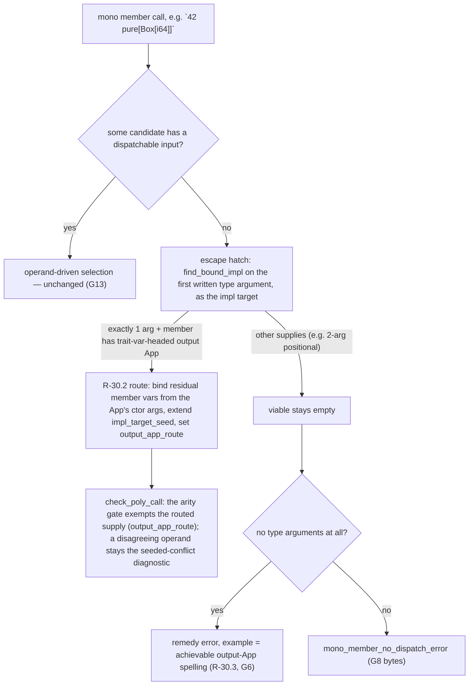

# P7b.S15 — Applicative.pure: return-type-polymorphic construction (SOO-30)

**Status:** Implemented on branch `soo-30` (base `846f952`) — recon `f104abb`,
gate relaxation `bc702fb`, round-3 measure-then-pin probe `dc6270e`, grounding
route `7373e2d`, library payload + roadmap correction `b02ea2b`. Suite 3585
passed / 0 failed at HEAD `b02ea2b`; `cargo fmt --check` and
`cargo clippy -- -D warnings` clean. All seven rulings below were ratified and
landed as written.
**Source:** SOO-30 "P7b — Applicative.pure: return-type-polymorphic
construction (library slice)", recorded out-of-scope in P7b.S6. Companion:
`Applicative.ap` remains gated on the constructor-of-quotation case.
**Discovery ground truth:** [slice15-paper-tests](./slice15-paper-tests.md)
(golden designs), probe rounds
[probes/soo30_findings.md](../../probes/soo30_findings.md),
[probes/soo30r2_findings.md](../../probes/soo30r2_findings.md),
[probes/soo30r3_findings.md](../../probes/soo30r3_findings.md), with byte-exact
baselines alongside each. Every golden was measured live before it was pinned.

## What was done and why

The ticket's premise was **falsified by the probes** — and correcting that
record is the slice's enduring value. P7b.S6's out-of-scope line claimed S6
had settled grounding for return-type-polymorphic words, so SOO-30 was filed
as library-only work. Three probe rounds proved the opposite at the base
tree: `pure ( 'A -- 'F['A] )` was **undeclarable** (the S2-15.a gate refused
any member whose nonempty inputs lack a dispatchable trait-var head), and
every mono call route for an output-only-`'F` member was walled — the arity
gate on the dissolved member word, a bare-call remedy whose own example was
unachievable, parse fences on both the bare-ctor spelling and `ap`, and a
named unbound-output error for the plain-word twin class. The callee side was
never the blocker: under a round-2 gate patch the shape declared and its
ctor-keyed impls checked everywhere. SOO-30 therefore landed as a **compiler
slice with a library payload**, and the roadmap's out-of-scope sentence was
rewritten to say so.

The compiler work is three moves, all riding already-measured machinery:

1. **The declaration gate admits output-App-headed members** (R-30.1) —
   App-headed only; a bare output var stays refused, because its dissolved
   member word's output has no App for impl selection to key on. The blast
   radius was measured before landing (round 2, r2f): exactly two pins move,
   both of the same `pick ( 'T -- 'F['T] )` shape.
2. **Output-side grounding at mono call sites** (R-30.2) — a single explicit
   type argument unifies against the member's trait-var-headed output App.
   Impl selection already keyed on the dissolved ctor head (the S6/S8b escape
   hatch reads `type_args.first()` as the impl target); the route adds the
   missing piece — the member's residual vars bind from the output App's
   arguments, positionally against the instantiation's ctor arguments — and
   the arity gate exempts the routed supply. **No** consuming-context
   inference (the S6 Q1 no-inference rule is load-bearing), no new
   `PolyType`/`Image` variant, no IR change.
3. **The bare-call remedy's example becomes achievable** (R-30.3) — it names
   the output-App spelling. Multi-impl traits take the first impl, recorded
   as deliberate in `mono_nullary_remedy_example`'s doc comment.

The library payload (R-30.7): `lib/core/applicative.sth` declares the trait —
`pure` only; per-ctor impls are co-located in `option`/`result`/`list` under
the orphan rule's target-module arm, each module gaining its own import
header (list's cell-boxing body also imports `intrinsics | ^ |`).

Method: the slice13 measure-then-pin posture. Round 3 (`dc6270e`) measured
every at-risk golden (G2–G6, G8, G13, G14) live before any golden was pinned;
all confirmed the ruled expectations — no verdict was escalated and nothing
was silently retargeted.

### The mono call-site route (landed shape)

The route is reachable **only** through the escape hatch (operand dispatch
failed): operand-driven selection, plain-word instantiation, the
concrete-target member branch, and the bare-ctor parse fence are untouched —
G8/G11/G13 pin the non-leakage byte-for-byte.

## Landed behavior

- The gate admits `pure ( 'A -- 'F['A] )` and its ctor-keyed impls check (G1).
  The refusal faces hold: a member mentioning the trait var nowhere, and one
  with only a *bare* output var, still refuse with the located S2-15.a text
  and member-position span, the nested-input note appearing only when the
  inputs nest the var (G10.3, G10.4).
- Exactly two pins moved, as ruled: the gate's own unit flipped to a success
  assertion and the slice2 golden retargeted in place to `build_ok` (G10.1/2).
- `42 pure[Box[i64]]` builds and prints `42` (G14); the shipped lib
  constructions dispatch end-to-end — Option (G2), 2-param Result with the
  partial ctor head riding along exactly as on the operand path (G3), a real
  `Cons` cell (G4).
- `repure['F: Applicative 'A] ( 'F['A] 'A -- 'F['A] ) swap drop pure` — the
  paper's corrected body, not the ticket sketch's `swap pure` — dispatches
  two constructors through one definition (G5, prints `7\n7\n`).
- Supplies that are not the single-argument output-App form keep today's
  bytes: a 2-arg positional supply fails operand-driven selection (G8); the
  double-wrap `'F`-headed-operand idiom survives (G13).
- The bare-call remedy keeps line 1 byte-identical (span included); its
  example is the achievable output-App spelling, and the old `pure[i64]`
  placeholder is gone (G6). The bare-ctor spelling `pure[Option]` stays
  parse-refused, word-general — the fence precedes module checking (G7).
- Plain-word output-only bound vars keep all three twin-class walls
  byte-identical: the arity error, the named `poly_unbound_output_error`
  (`src/check/poly.rs:5866`), and the parse-refused HKT remedy (G11.a/b/c).
  `ap` stays undeclarable at parse (G9). The zero-input escape-hatch impl
  mismatch stays as-is (G12).
- The roadmap records the corrected story: an S15 section in
  `docs/roadmap/P7b-higher-kinded-types.md`, the out-of-scope sentence
  rewritten to say S6 did **not** settle the grounding and S15 landed it as
  compiler + library work, and the aggregate P7b row in
  `docs/roadmap/ROADMAP.md` amended.

## Golden inventory

All in `tests/phase7b_slice15.rs` except where noted.

| Golden | Test | Pins |
| --- | --- | --- |
| G1 | `true_shape_member_declares_and_ctor_impl_checks` | gate admits the true shape; ctor impl checks |
| G2 / G3 / G4 | `option_ctor_constructs_through_the_output_app_instantiation` / `result_two_arity_ctor_constructs_with_partial_head` / `list_ctor_constructs_a_real_cons_cell` | lib constructions through the route (`5\n` each) |
| G5 | `shared_bound_consumer_dispatches_two_ctors_through_one_definition` | `repure` two-ctor dispatch (`7\n7\n`) |
| G6 | `bare_call_remedy_example_is_the_achievable_output_app_spelling` | remedy line 1 byte-identical + `pure[Box[i64]]` example; `pure[i64]` gone |
| G7 | `bare_ctor_instantiation_argument_stays_parse_refused` | `pure[Option]` fence on the lib spelling |
| G8 | `two_arg_positional_supply_stays_operand_driven_no_dispatch_error` | conservative non-route bytes |
| G9 | `ap_declaration_stays_parse_fenced` | S1-6 quotation fence bytes |
| G10.1/2 | `check_trait_decls_accepts_member_with_only_output_trait_var` (`src/check/declarations.rs` tests) + `hkt_member_with_only_output_trait_var_declares` (`tests/phase7b_slice2.rs`) | the only moved pins |
| G10.3/4 | `hkt_member_mentioning_the_trait_var_nowhere_is_located_error` + `hkt_member_with_only_a_bare_output_trait_var_is_located_error` (`tests/phase7b_slice2.rs`) | the gate's refusal faces, incl. the R-30.1 App-headed-only delta |
| G11.a/b/c | `plain_word_output_only_var_single_arg_supply_is_arity_error` / `…_bare_call_is_named_unbound_output_error` / `…_hkt_remedy_spelling_stays_parse_refused` | twin-class walls |
| G12 | `zero_input_escape_hatch_still_fails_impl_check` | P2e identical renderings, as-is |
| G13 | `double_wrap_operand_idiom_survives_the_route` | operand idiom unchanged |
| G14 | `output_app_instantiation_prints_at_mono_call_without_operand` | the route itself: `42\n`, fixture-local Box |

Units beside the machinery — gate:
`member_binds_trait_var_accepts_an_app_headed_output_mention`,
`member_binds_trait_var_rejects_a_bare_output_mention`,
`member_binds_trait_var_rejects_a_member_mentioning_the_var_nowhere`,
`check_trait_decls_rejects_member_mentioning_the_trait_var_nowhere`
(`src/check/declarations.rs` tests); route:
`mono_member_output_app_route_binds_residual_vars_from_ctor_args`,
`two_param_ctor_target_binds_residual_var_from_single_output_app_arg`,
`unrouted_wrong_arity_supply_on_route_shaped_member_keeps_arity_error`,
`bare_output_app_member_remedy_names_the_achievable_spelling`
(`src/check/poly/tests.rs`).

## Rulings (ratified — landed as written)

### R-30.1 — the gate admits an output-App-headed member; App-headed only

`member_binds_trait_var` (`src/check/declarations.rs:416`) gained an output
arm: a member whose nonempty inputs don't mention the trait var is admitted
iff at least one output mentions it as an application head — `App { head: 0 }`,
under one `Ref` layer, mirroring the input arm's ref-unwrapping courtesy
(`dispatchable_head`, `:404`). The refusal arm keeps the located S2-15.a text
and the conditional nested-input note (`member_inputs_nest_trait_var`,
`:436`) unchanged.

**Rejected:** a bare-`'F` output member is a different, unneeded beast — its
dissolved member word has no App in its output to key impl selection on
(R-30.2's route has nothing to unify against), no ticket requirement names
it, and no probe measured it. The round-2 probe patch reused
`dispatchable_head` verbatim over the outputs, which would also have admitted
a bare `Var(0)` output — the shipped predicate is App-headed-only, and the
refusal of the bare-output shape is pinned by G10.4. The relaxation's blast
radius was measured (r2f): exactly the two gate pins flipped, nothing else.

### R-30.2 — output-side grounding: the single explicit instantiation unifies against the member's output App

At a **mono** call on a member with no dispatchable input whose output row
contains a trait-var-headed App, a **single** explicit type argument unifies
against that output App: `5 pure[Option[i64]]` dissolves `'F:=Option`,
`'A:=i64`; impl selection keys on the **dissolved ctor head**; partially
applied ctor heads ride along exactly as on the operand path. Mechanically
this extended the existing S6/S8b escape hatch
(`src/check/poly/ground.rs`, the `viable.is_empty()` arm), whose
`find_bound_impl` (`src/check/poly/trait.rs:174`) already reads the first
instantiation argument **as the impl-target/output type**; the route binds
the member's residual vars from the output App's arguments and exempts the
routed supply from the arity gate (`src/check/poly.rs`, `output_app_route`).
The bare-ctor spelling `pure[Option]` **stays parse-refused** (G7 bytes).

**Rejected alternatives.** (a) Consuming-context inference — the S6 Q1
no-inference rule is load-bearing
(`bare_nullary_member_without_instantiation_is_located_error`,
`tests/phase7b_slice6.rs`): the route fires only on an explicit
instantiation, never a lookahead. (b) Generalizing output-keyed impl
selection to **positional** supplies (the ≥2-arg forms) — it would flip G8's
measured diagnostic with no ticket requirement behind it, for a larger delta
across the dispatch path; G8/G13 keep their conservative, measured bytes.
(c) Lifting the bare-ctor parse fence so `pure[Option]` names the head —
kind-unaware fence surgery in the parser for no gain; the applied spelling
parses and is golden (G2–G4).

### R-30.3 — the bare-call remedy keeps its shape; its example becomes achievable

The bare-call remedy error (`mono_nullary_member_no_instantiation_error`,
`src/check/poly/ground.rs:1573`) keeps its located two-line shape — line 1
byte-identical to the r2b-2 measurement — but the example token is
**achievable**: a spelling that, substituted at the same call site, builds
and dispatches under the shipped semantics. That is the output-App spelling
(`pure[Box[i64]]` for the G6 fixture). **Rejected:** the positional two-arg
form (`pure[i64 i64]`) — under R-30.2's conservative G8 it still fails impl
selection, so following it would reproduce the failure the correction exists
to remove. Exact example bytes were pinned from the live binary before the
golden asserted (measure-then-pin).

### R-30.4 — plain-word output-only bound vars stay walled (deferred)

The twin class's three walls (the arity wall, the named
`poly_unbound_output_error`, the unachievable HKT remedy) stay byte-identical.
R-30.2 names member calls only; plain-word output-only grounding is deferred.
Shared-bound consumer goldens use an `'F`-in-input consumer shape (`repure`)
— callable at mono sites by operand grounding.

### R-30.5 — `ap` stays out; the shipped trait declares pure only

`ap ( 'F[ [ 'A -- 'B ] ] 'F['A] -- 'F['B] )` cannot appear in any trait
declaration — the S1-6 parse fence fires first (`app_arg_quotation_error`,
`src/parser.rs:2880`). The S7 deferral stands and no phase touched the fence.

### R-30.6 — the P2e zero-input defect is recorded, not fixed

The identical-renderings impl mismatch (G12's bytes) is pre-existing,
independent of the gate relaxation, and unreachable on the true shape (its
output argument is a `Var`). It stays as-is, pinned by G12; fixing
`check_poly_body`'s residual comparison (`residual_pt != sig.outputs`,
`src/check/poly.rs:905` — a syntactic `PolyType` `PartialEq`,
`src/ast.rs:2644`) is a separate defect ticket.

### R-30.7 — the trait ships in `lib/core`, impls co-located in the target modules

`lib/core/applicative.sth` follows the `lib/core/iterator.sth` pattern
(header comment, own `import:` lines, `export: Applicative ;`; member names
are **not** exported — synthesized member words are never bare-nameable).
`lib/core/sooth.pkg` lists `applicative` before `option`; per-ctor impls are
co-located in option/result/list, admitted by the orphan rule's
target-module arm. Each impl module has its own `import:` header for what
its body needs (the applicative import always; `intrinsics | ^ |` for list's
cell-boxing body). Consumer goldens import the trait + ctors, never a member
name.

## Open questions — all resolved

- [x] Do R-30.1–R-30.7 stand? — ratified and landed as written (`bc702fb`,
  `7373e2d`, `b02ea2b`); the round-3 probe confirmed every at-risk golden
  before pinning (`dc6270e`), so no expectation flipped.
- [x] Multi-impl remedy rendering — resolved in code: first impl, recorded
  deliberate in `mono_nullary_remedy_example` (`src/check/poly/ground.rs:1629`);
  only the single-impl case is golden-pinned (G6) — the multi-impl rendering
  remains a watch item below.
- [x] Bare-`Var(0)` output members under the relaxed gate — App-headed only
  per R-30.1; pinned negative (G10.4).
- [x] Does G8 flip under output-keyed selection? — conservative (positional
  supplies keep operand-driven selection); confirmed by round-3 measurement
  before pinning (G8).
- [x] `repure`'s body — `swap drop pure`, not the ticket sketch's `swap pure`
  (G5 pins it).

## Deferred follow-ups

- **`ap`'s constructor-of-quotation landing.** The S1-6 parse fence stands
  (G9); the S7 deferral holds and the impl-side audit arms remain unreachable
  as spelled.
- **Twin-class output-only plain-word grounding.** R-30.2 names member calls
  only; the plain-word class's three walls stay byte-identical (G11).
- **P2e zero-input defect ticket.** The identical renderings
  (`poly_type_str`'s Concrete/Generic collision) mislead a debugger into
  "fixing" G12 here; the root cause is cited in R-30.6 for the follow-up
  ticket.
- **Seeded-conflict pin unit.** Deferred during the `7373e2d` review: the
  P7.S3t discipline (a disagreeing operand stays the seeded-conflict
  diagnostic, never silent re-grounding) is documented at the route and
  relied on via existing pins; no dedicated unit was added.
- **Multi-impl remedy rendering.** First-impl is the recorded choice; no
  golden pins the multi-impl case.
- (Recorded, not fixed: the declaration-gate error omits the file path when
  it fires inside an imported lib module — round-1 P3min.)

## Implementation

**Recon & probes** — `f104abb`: the original spec + paper tests and probe
rounds 1–2 (`probes/soo30_findings.md`, `probes/soo30r2_findings.md`, byte
baselines, ~20 fixture files). `dc6270e`: round 3
(`probes/soo30r3_baseline.md`, `probes/soo30r3_findings.md`, `g2`–`g14`
fixtures) — every at-risk golden confirmed before pinning.

**Phase 1 — gate relaxation** — `bc702fb`: `src/check/declarations.rs`
(the App-headed-only output arm in `member_binds_trait_var:416`; flipped unit
`check_trait_decls_accepts_member_with_only_output_trait_var`; new
predicate/refusal units; retained array-input unit), `tests/phase7b_slice2.rs`
(retargeted `hkt_member_with_only_output_trait_var_declares` + the two
negative siblings), `tests/phase7b_slice15.rs` (new; G1, G9, G12).

**Phase 2 — output-side grounding route + remedy** — `7373e2d`:
`src/check/poly/ground.rs` (`output_app_route` flag, residual-var binding,
`output_trait_var_app`/`instantiation_ctor_args` helpers, remedy rendering
via `mono_nullary_remedy_example:1629` →
`mono_nullary_member_no_instantiation_error:1573`),
`src/check/poly.rs` (`output_app_route` parameter; arity-gate exception —
`type_args.len() != sig.ty_var_names.len() && !output_app_route`),
`src/check/terms.rs` (callers pass `false`), `src/check/poly/tests.rs` (4
route units), `tests/phase7b_slice15.rs` (G6, G8, G11.a–c, G13, G14). Suite
3569→3580, zero unexpected movement.

**Phase 3 — library payload + roadmap correction** — `b02ea2b`:
`lib/core/applicative.sth` (new), `lib/core/sooth.pkg` (`applicative` before
`option`), `lib/core/option.sth` / `result.sth` / `list.sth` (import headers;
`pure` impls: `Some`, `Ok`, `Nil ^ Cons`), `tests/phase7b_slice15.rs` (G2–G5,
G7), `docs/roadmap/P7b-higher-kinded-types.md` (S15 section; out-of-scope
sentence corrected), `docs/roadmap/ROADMAP.md` (P7b row).

Suite at HEAD `b02ea2b`: 3585 passed / 0 failed; `cargo fmt --check` and
`cargo clippy -- -D warnings` clean.
