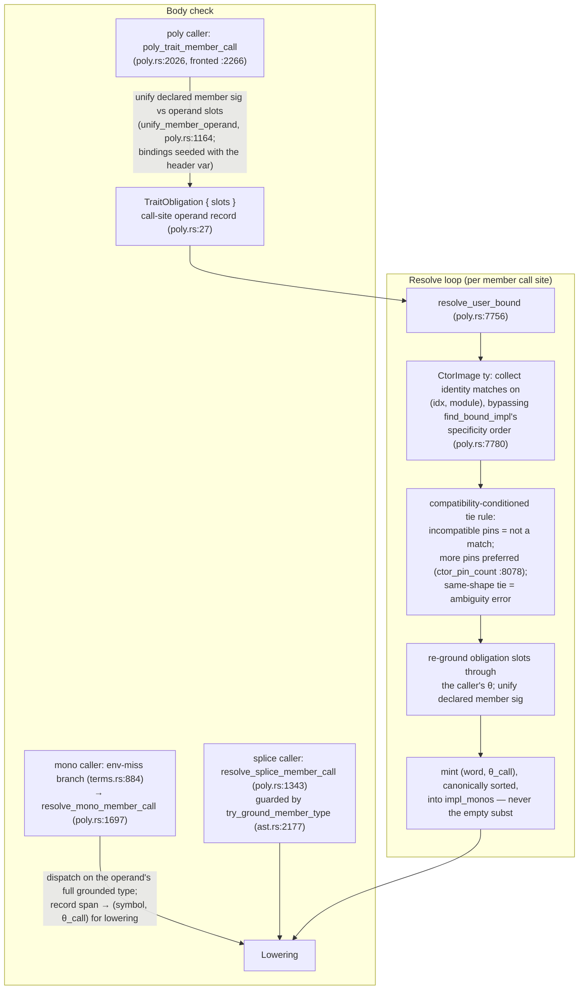

# P7b.S2 spec — constructor-keyed dispatch and higher-kinded trait declarations

Status: **Implemented** — `f394b4b` (phase 1), `8a97781` (phase 2), `d88b056` (phase 3),
`1d1a3c6` (phase 4) on branch `p7b-s2` (base `5443a0d`); full gate
(`cargo fmt --check && cargo clippy -- -D warnings && cargo test`) verified green this
session, including `tests/phase7b_slice2.rs` 17/17 and `tests/phase7b_slice1.rs` 16/16.

Scope input was the recon [brief](./slice2-brief.md) (findings F1–F14, rulings R1–R11,
witnesses W1–W6) and the verbatim [probe log](./slice2-probes.md); exit criteria are from
the [phase doc](../P7b-higher-kinded-types.md). Diagnostic texts pin **shape**, not
wording; exact strings froze in the goldens (`tests/phase7b_slice2.rs`).

## What was done and why

The slice makes traits like the phase doc's Functor real:

```sth
trait: Functor['F: * -> *] : map ( 'F['T] [ 'T -- 'U ] -- 'F['U] ) ;
impl: Functor for Option
: map ... ;
```

S1 could already dispatch an *applied-var* impl target (`impl: Functor for Box['T]` —
matching, dedup, specificity, bounded dispatch all worked), but the gap was everywhere a
member signature needed to mention `'F['T]`: the trait header's kind annotation was
parsed and silently discarded (F4), the member single-variable gate killed any
App-shaped member before shape checks could run (F5), the member dispatchability rule
only recognized a bare trait-var input (F6/m1), no impl-target arm matched a
`CtorImage` (F8), and the checker had no path at all to check an HKT member call — poly
callers used structural equality that can never match an App slot, mono callers saw an
unknown word, and splice grounding would flow a `CtorImage` unchecked into a value-type
position. Every downstream failure traced back to member signatures.

The load-bearing decisions, and why:

- **No new type/pattern representations.** Bare and partially-applied ctor targets
  desugar to the existing applied-fresh-var pattern (`for Option` ≡
  `for Option['ctor0 …]`, `for Result[i64]` ≡ `for Result[i64 'ctor1]`) — the probes
  (m2) had shown everything downstream of the target slot runs unchanged, so only sugar
  plus user-spelling diagnostic rendering was needed. Rejected along the way: a fresh
  impl-target pattern representation, R2(a)'s partial-application image (a new
  `Subst`/`Type` shape — heaviest machinery, and the leading-slot rule meets the exit
  criteria without it), and R2(c)'s fence on multi-arg ctors (contradicts the
  `Result['T 'E]` exit criterion; W3 is the witness).
- **The header kind is published and enforced.** `TraitDecl` carries the header var's
  kind and span; each member's var 0 is seeded with that kind *before* the effect parse,
  so `'F: * -> *` vs a bare `'F` mention in a member is a located error carrying both
  spans. The member single-variable gate is lifted (members declare their own `'T`/`'U`
  locals); the one-var limit stays on the header bracket itself.
- **HKT-aware dispatchability.** A member must have an input that is the trait var bare
  (or under one `&`) or **heading an application**. Ref-ness stays an addressing mode,
  not a type identity, so `&'F['T]` dispatches like S1's `&'F` did — dropping that would
  have broken every S1-style ref-member trait (`Shw`).
- **Member shape gate with two real arms.** An `App` is supported iff the trait's own
  variable heads it; a `Quotation` is supported iff its rows are App-free. An App inside
  a member quotation row is fenced (F10: declarations *represent* it, but body-level
  `call` cannot see through it — Monad.bind is a later slice's extension).
- **The member word's `PolySig` union** (S2-5) is the structural heart: target/header
  variables keep their ids and order (so every `where`-bound survives the merge — the
  bounds table is cloned keyed by target ids), member locals append after them and are
  never renumbered, and every variable carries its real introduction span instead of the
  old `Span::default()` stamps, so diagnostics name binding sites.
- **Leading-slot grounding** (S2-6): a member `'F[X₁…Xₙ]` against target
  `Generic(C, [A₁…Aₘ])` grounds to `Generic{C, memberArgs ⧺ targetArgs[n..]}` — member
  args occupy the leading ctor slots, leftover slots are the impl's own variables. The
  `n ≤ m` arity check (S2-15.c) lives **inside the grounding App arm at parse time**,
  the only point where both arities are in hand; a check-time-only validation would be
  reached only after the arm had already sliced out of bounds. This is what lets
  `map` over `Result['T 'E]` ground to `Result['T 'E]` → `Result['U 'E]` (the `Err`
  pass-through exit criterion) while a pinned prefix (`for Result[i64]`) stays
  `Concrete(i64)`.
- **Dispatch on constructor identity alone** (S2-8): `match_impl_target_rec`'s
  `CtorImage` arm matches a `Generic` target pattern on `(idx, module)` without
  comparing args; args are re-derived per member call site. Rejected: comparing args
  inside the match — it would force a second monomorph of the same `(word, θ)` and
  fight the per-call-site instantiation the phase doc pins. Selection *among* identity
  matches is the **compatibility-conditioned tie rule**, run per call site in the
  resolve loop (not `find_bound_impl`'s specificity walk, which cannot compare
  `CtorImage` operands at all): a pinned target whose pins disagree with the caller's
  grounded operand args is *not a match*; among compatible candidates more pins win;
  an identical pin-shape tie is the ambiguity error. Without the compatibility
  condition, `for Option[i64]` would win at every ctor-abstract site and then fail its
  own pinned member input where the polymorphic `for Option` should have served.
- **`for 'T` never captures a CtorImage** (S2-15.e): a bare-var target cannot ground its
  member against a constructor image (S1-15.g), so it is refused — a dedicated located
  diagnostic instead of a silent capture that fails worse downstream.
- **Per-site composition, not resolve-time guessing** (S2-9): at body-check the caller's
  slots are still abstract, so θ_call cannot exist yet. The obligation therefore carries
  the call site's consumed operand slots; at the resolve loop, where the caller's θ is
  concrete, the slots are re-grounded through θ, the declared member sig unifies against
  the results, and the resulting θ_call is minted **canonically sorted** (the P7.S3t
  invariant — two construction sites must mint one symbol for the same `(word, θ)`).
  The degenerate empty subst for a CtorImage-selected winner is never seeded; it would
  monomorph the member word at ∅ and die on `map`'s unbound output variable.
- **The member-call machinery** (S2-16, R11): the poly caller unifies the trait's
  *declared* member sig (not the ctor-headed grounded sig, which would wrongly
  concretize the caller's bound variable) against the operand slots; the mono caller is
  a brand-new path in the `env.get`-miss branch (after check-time mints take
  precedence, before the unchanged unknown-word fallthrough), dispatching on the
  operand's full grounded type and recording the result **span-keyed for lowering**
  (the `builtin_overloads` pattern — a mono caller has no obligation/`CallInst` path);
  the splice path keeps working but its grounding is guarded by the **non-raising**
  `try_ground_member_type` (S2-15.f), so a diagnostic builder can never raise from
  inside the error it is building.
- **Orphan and mangling catch up with ctor targets** (S2-11/S2-12): a ctor-abstract impl
  may live in the constructor's module or the trait's module (same rule concrete targets
  get); builtin-shaped ctor images are trait-module-only, stated. Monomorph symbols key
  ctor images on `GenericId` (`c{idx}m{module}_{name}`), closing the S1-12 residual
  hazard that same-named ctors in different modules mint one symbol — reachable only
  once ctor-keyed dispatch exists.
- **Zero-field ctor arms unify** (S2-13/F14): a zero-field variant ctor in a polymorphic
  eliminator arm now routes to the symbolic path and unifies with the arm's ambient type
  variable instead of minting a mono instantiation (the "rigid across arms" error). This
  unblocks W2's `None` arm; field-carrying ctors already unified.
- **The cross-call fence is not lifted** (S2-10, R7 amended): the review showed member
  calls never reach `poly_cross_match` (`poly_trait_member_call` fronts them), so the
  original lift recommendation was aimed at the wrong site; the fence governs named
  poly-word cross-calls and stays as p8's regression baseline. W4's `twice` is unblocked
  by the poly-caller unification instead.

## The member-call path

Three caller shapes converge on dispatch; θ_call exists only from the resolve loop on,
which is why the obligation carries operand slots rather than a finished substitution.



## Deliberate limitations and non-goals (S2-14 ledger)

- **App inside member quotation rows is fenced** (S2-15.d) — declarations represent it,
  `call` cannot see through it; Monad.bind awaits a later slice.
- **Fully-abstract App-headed targets** (`for 'F['T]`) keep their fence
  (`impl_target_app_unsupported_error`); m3 showed they degrade safely, but the focused
  message is better UX and no exit criterion needs them.
- **Quotation-valued outputs** stay an S10 slice-7 boundary.
- **The F12 ctor-word wart** (a bare generic ctor as a value word in a mono body) is
  recorded, not fixed; goldens use declared-sig helpers (`mkopt`) as the S1 goldens do.
- **F13** (order-dependent field-mismatch after an `inline` word with a `~[` param) is
  dodged by idiom — the pinned non-inline member body (`: map swap ~[ ... ] Opt? ;`) —
  not fixed.
- **W3/W4 goldens run over fixture-local type twins**, not lib `core::option` /
  `core::result`, per the S1-era module-identity wart recorded in
  [Open questions](#open-questions); the wart fix is deferred to a future slice.

## Implementation

Verified against HEAD `1d1a3c6` this session: every symbol below was read at its cited
location, and the full gate passes (`cargo fmt --check`, `cargo clippy -- -D warnings`,
`cargo test` — 78 suites green; `tests/phase7b_slice2.rs` 17/17,
`tests/phase7b_slice1.rs` 16/16).

### Requirements → commits → code → goldens

| Req | What it does now | Commit | Where (verified) | Golden |
| --- | --- | --- | --- | --- |
| S2-1 | header kind + span published on `TraitDecl` (landed as `var_kind`/`var_span`, spec said `kind: Kind`); member var 0 seeded pre-effect-parse; member single-var gate lifted, header-bracket gate kept | `f394b4b` | `ast.rs:1942`; `parser.rs:3760` | #1, errors #1/#2 |
| S2-2 | HKT dispatchability: trait var bare/under-`&` or heading an App | `f394b4b` | `declarations.rs:395` (`dispatchable_head`, `member_binds_trait_var`) | error #1 |
| S2-3 | `member_shape_is_supported` App arm (head = trait var) + App-free-row Quotation arm | `f394b4b` | `parser.rs:378` | error #4 |
| S2-4 | bare/partial ctor desugar to applied-fresh-var; user spelling rendered; `'ctor*` prefix reserved | `8a97781` | `parser.rs:568`/`:589`/`:872` | #5, #7 |
| S2-5 | member-word `PolySig` union id space (target vars first, locals appended, real spans) | `8a97781` | `ast.rs` `ImplTarget.ty_var_spans`, `MemberVarMap` | #5 |
| S2-6 | leading-slot grounding App arm; concrete-target App fenced parser-side (recorded deviation, see [Open questions](#open-questions)) | `8a97781` | `ast.rs:2242` (App arm `:2330`); `fence_member_app_against_concrete_target` `ast.rs:2096` ← `parser.rs:4163` | #3, #7 |
| S2-7 | `n ≤ m` arity check inside the grounding arm, at parse time | `8a97781` | `ast.rs:2336` | error #3 |
| S2-8 | CtorImage identity arm; compatibility-conditioned tie rule per site; `for 'T` catch-all guard | `d88b056` | `poly.rs:8362` (arm), `:7780` (tie), `:8269` (guard) | #8, error #5 |
| S2-9 | obligation carries operand slots; resolve loop re-grounds and mints canonically-sorted θ_call; empty subst never seeded | `d88b056` | `poly.rs:27` (`TraitObligation.slots`), `:7869` | #2, #4 |
| S2-10 | cross-call fence **not** lifted; p8 fence text regression-pinned | `d88b056` | test `poly.rs:11468` | unit |
| S2-11 | orphan rule: Generic target homes to the ctor's module; builtin images trait-module-only | `8a97781` | `declarations.rs:491` | #9 |
| S2-12 | mangling keys ctor images on `GenericId` (`c{idx}m{module}_{name}`) | `d88b056` | `ast.rs:2865` | #10 |
| S2-13 | zero-field ctor arm unifies with the ambient var (symbolic path replaces the vacuous exact-match gate) | `8a97781` | `poly.rs:5447`; unit test `:13359` | #6 |
| S2-14 | ledger of kept fences / non-changes (i)–(v) | all | (i) `parser.rs:378`; (ii) App-target fence; (v) `poly.rs:7779`+ `unreachable!` arms stay | — |
| S2-15 | diagnostics family a–f | `f394b4b`/`8a97781`/`d88b056` | a `declarations.rs:417`; b parser-side both spans; c `ast.rs:2336`; d `parser.rs:3799`ff; e `poly.rs:8269` + `:8088`; f `ast.rs:2177` | errors #1–#5 |
| S2-16 | poly-caller unification; new mono member-call path; guarded splice path | `d88b056` | `poly.rs:2026` / `:1164` / `:1697` (wired `terms.rs:884`) / `:1343` | #2, #4 |

### Goldens (`tests/phase7b_slice2.rs`, all passing)

Positive: #1 `hkt_trait_declaration_with_app_and_quotation_member_typechecks` (W1),
# 2 `functor_map_over_option_dispatches_and_produces_option_of_bool` (W2),
# 3 `functor_map_over_result_dispatches_to_the_result_impl_and_passes_err_through` (W3),
# 4 `functor_map_through_shared_bound_dispatches_per_constructor_from_poly_body` (W4),
# 5 `bare_ctor_impl_target_resolves_and_dispatches`,
# 6 `zero_field_ctor_unifies_with_ambient_var_in_poly_arm`,
# 7 `partially_applied_ctor_impl_target_binds_explicit_prefix`,
# 8 `concrete_impl_wins_over_ctor_impl_by_specificity`,
# 9 `ctor_impl_in_ctor_module_satisfies_orphan_rule`,
# 10 `same_named_ctors_in_two_modules_dispatch_distinct_impls`.
Errors: #1 `hkt_member_without_dispatchable_input_is_located_error`,
# 2 `trait_header_kind_conflicting_with_member_usage_is_error`,
# 3 `member_app_arity_exceeding_target_ctor_arity_is_error`,
# 4 `app_inside_member_quotation_row_is_fenced`,
# 5 `bare_var_impl_target_does_not_capture_ctor_image`.
Non-regression (W6): `applied_target_functor_dispatch_unchanged`,
`s3t_explicit_instantiation_spelling_unchanged`, plus `tests/phase7b_slice1.rs` green;
the S2-10 fence baseline is the unit test `non_member_app_cross_call_still_rejects_with_p8_fence_text`
(`poly.rs:11468`).

### Load-bearing anchors at HEAD `1d1a3c6`

The original spec's anchor table pinned pre-implementation lines at `5443a0d`; the
implementation shifted them. Current positions, verified this session:

| Anchor | Now at |
| --- | --- |
| `parse_trait_decl` / header multi-var gate | `parser.rs:3587` / `:3598` |
| `parse_trait_member_effect` (seeds var 0, gate lifted) | `parser.rs:3760` |
| `member_shape_is_supported` / App-in-row fence | `parser.rs:378` / `:411` |
| S2-15.a dispatchability error | `declarations.rs:417` |
| `ground_member_type` / `try_ground_member_type` / `ground_member_poly` | `ast.rs:2127` / `:2177` / `:2242` |
| `fence_member_app_against_concrete_target` | `ast.rs:2096` (call site `parser.rs:4163`) |
| `match_impl_target_rec` / CtorImage arm / `for 'T` guard | `poly.rs:8250` / `:8362` / `:8269` |
| `resolve_user_bound` / tie rule / `ctor_pin_count` | `poly.rs:7756` / `:7780` / `:8078` |
| `poly_trait_member_call` / `unify_member_operand` / fronting | `poly.rs:2026` / `:1164` / `:2266` |
| `resolve_mono_member_call` / env-miss wiring | `poly.rs:1697` / `terms.rs:884` |
| `TraitObligation` (+ `slots`) | `poly.rs:27` |
| S2-13 zero-field fix | `poly.rs:5447` (unit test `:13359`) |
| CtorImage mangling | `ast.rs:2865` |
| `impl_target_module` Generic arm | `declarations.rs:491` |

## Open questions

- **S2-13 / F14 routing.** The plan fixed ctor-var arm unification directly (golden #6).
  The recorded fallback — routing W2 around F14 with a field-carrying shape if the fix
  exceeded slice scope — **never fired**: the fix landed in `8a97781`
  (`poly.rs:5447`, symbolic path) and golden #6 passes. Kept here so the fallback and
  its trigger remain on record.
- ~~**S2-10 cross-call lift breadth.**~~ Resolved by the R7 amendment (260831, after the
  three-lane spec review): the fence is **not lifted** — member calls never reach
  `poly_cross_match`, so the lift was aimed at the wrong site; S2-16 owns App slots and
  p8's baseline stays passable. Recorded in S2-10 above.
- **S2-6 `ground_member_type` App arm — deliberate location-of-check deviation.** The
  spec's "retire the `unreachable!` with a located message" is implemented parser-side
  instead: `fence_member_app_against_concrete_target` raises the located S2-6 error at
  the desugar before grounding, so the arm stays `unreachable!` (a non-raising backstop,
  consistent with S2-15.f's non-raising-signature constraint — `ground_member_type`
  returns `Type`, not `Result`). Observable behavior conforms; recorded deliberately,
  not silently (Phase 2 review round). Verified at HEAD: fence at `ast.rs:2096`, called
  from `parser.rs:4163`; the `ground_member_type` App arm is the `unreachable!` backstop.
- **W2's two recorded deviations.** (1) The golden's call carries the explicit
  instantiation `map[i64 Bool]` rather than the bare spelling: `map`'s `'U` is bound
  only by the quotation's rows, and the pre-existing P7.S3t unbound-row-var behavior
  makes the bare spelling unspellable from a mono caller — the dispatch machinery
  (CtorImage identity, per-site composition, θ_call) is fully exercised either way.
  (2) The observable is `true`, proving the mapped inner value is a `Bool` (i.e.
  `Option[Bool]`), rather than the brief sketch's `some 0` — the exit criterion
  governs the exact stdout, and the fixture-local printer proves the type-directed
  dispatch.
- **W3/W4 run over fixture-local twins — the S1-era module-identity wart (Phase 4,
  supervisor-approved 260831).** Goldens #3/#4 use local `Result`/`Opt`/`Res` twins
  rather than the lib `core::result`/`core::option` types: a lib-declared generic
  header cannot take a ctor-keyed `impl:` from a user module yet. The wart, precisely:
  the operand's instantiation is minted at the *naming* module (`resolve_type_or_apply`
  → `instantiate_*` with the parsing module; memo key `(idx, module, args, lens)`),
  while the impl target pattern records the header's *declaring* module, and both
  dispatch paths compare the two for equality — `match_impl_target_rec`'s `Generic`
  arm and the CtorImage identity match. Observed verbatim: a mono caller reports "no
  `impl:` in this program dispatches on these operands"; a poly caller reports "cannot
  instantiate `'F` … does not satisfy `Functor`". This is the same convention golden #7
  documents and routed around; committed W2 (golden #2) set the twin precedent. What
  W3/W4 prove — leading-slot displacement and shared-bound App-vs-App unification with
  S2-9's re-grounding — is the machinery under test, not the type's provenance; the
  wart fix (memo key or module-blind matching) is an S1-era convention change deferred
  to a future slice/ruling.
- **W4's sketch deltas (Phase 4).** (1) The brief's `map map` consumes the quotation
  parameter on the first call; plain quotations are `Copy`, so the working form binds
  it to a local and re-reads it (`| q | q map q map`). (2) The sketch's one
  `Functor['F: * -> *]` over both `Some` and `Ok` is kind-inconsistent — a `* -> *`
  Functor's `'F['T]` cannot unify against a two-argument `Result` operand (App-vs-App
  unification requires equal argument counts) — so the shared trait is
  `* -> * -> *` (as the S2-8 tie-rule unit fixtures already are) and both ctor twins
  are two-parameter types, `Opt`'s `None` exercising golden #6's zero-field arm
  unification. (3) Local twins per the bullet above.
