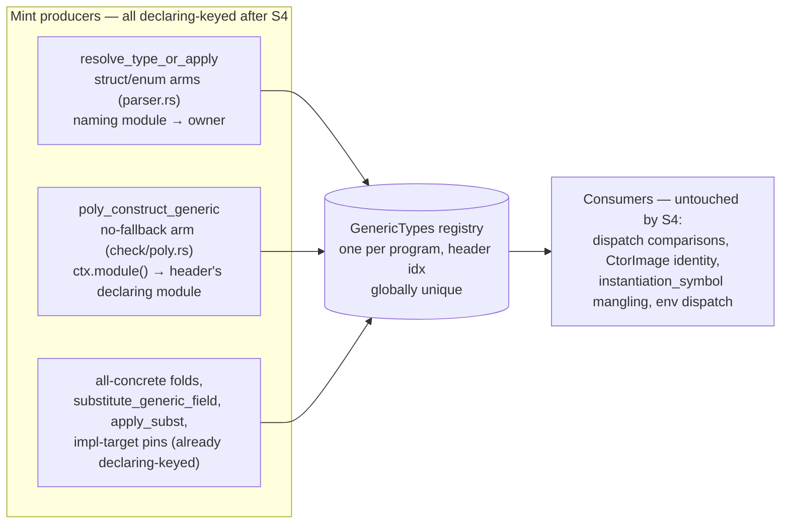

# P7b.S4 spec — declaring-module identity for generic instantiations

**Status: Implemented** — all four phases landed, reviewed, and committed on branch
`p7b-s4` (base `ad136f3`): `1fff1b5` (phase 1), `bca5bfd` (phase 2), `afe2164`
(phase 3), `7a10cd6` (phase 4). Scope input was the recon
[brief](./slice4-brief.md) (findings F1–F8, open questions Q1–Q5) and the verbatim
[probe log](./slice4-probes.md); those two documents are the historical record of the
pre-implementation state and are preserved unchanged.

## What was done and why

Cross-module generic instantiation identity was keyed on the *naming* module — the
module that spelled `Option[i64]` — rather than the *declaring* module — the one that
declared the `Option['T]` header. Because a minted `Type` compares by handle identity,
the same rendering spelled from two modules produced two distinct handles, and the
compiler failed in four ways: mono member calls on operands named in a non-declaring
module rejected with the useless `` `showopt` expected `Option[i64]`, found
`Option[i64]` ``; shared-`Functor`-bound poly dispatch could not discharge; two user
modules each naming `Option[i64]` failed to build order-dependently (`type mismatch in
mk`); and recursive headers minted duplicate `Cons` overloads. The recon brief (F1)
reduced the wart to exactly two naming-keyed producers among the mint producers —
`resolve_type_or_apply`'s struct/enum arms (`src/parser.rs`) and
`poly_construct_generic`'s no-fallback arm (`src/check/poly.rs`); grep over the landed
tree confirms every other production mint site (all-concrete folds,
`substitute_generic_field`, `apply_subst`, impl-target pins) already passes a
header-derived declaring module. Soundness of dropping the module from identity falls
out of the registry layout: one `GenericTypes` per program (`src/driver.rs:671`) makes
the header index globally unique, so `(idx, args, lens)` identifies a header without
any module.

The fix is candidate C, the probe round's measured winner (not a fresh adjudication):
key those two producers on the header's declaring module. Three changed lines, zero
comparator edits, zero memo-key edits — every producer and consumer of the
instantiation's identity agrees on one mint, and the mono-symbol dedup follows
automatically (one mint → one `sooth_mono_*` symbol).

Rejected alternatives, with the reasoning that killed them:

- **A — drop `module` from the memo keys**: dispatch stays module-strict (P1/P2
  baseline errors unchanged) and the minted decl's `.module` becomes a first-minter
  lie; the dedup-plus-recovery variant converges with C observably while churning key
  shapes, lookup signatures, and every tuple consumer.
- **B — blind the four dispatch comparisons**: fixes poly bound dispatch but mono dies
  at a plain `Type` equality outside every PolyType comparator — same rendering, two
  distinct minted handles. B can never fix the mono half of the exit criterion
  (recorded as the fallback design with its ceiling).
- **A+B together**: A's key churn plus B's comparator churn to reach what C reaches
  with three lines; comparator blindness is only needed because the mints disagree,
  which C removes at the source.
- **Orphan relaxation (m3)**: killed by probe P7 — the orphan rejection of a
  user-module impl for a concrete-pinned lib target is byte-identical today and under
  C, because the impl-target pin already minted declaring-keyed.

Open questions, all ruled at spec time and resolved as ruled:

- **Q1 (re-baseline text)**: exactly one test rewritten — the qualified cross-module
  application test now pins the declaring-module mint (`.module == 0`) and its doc
  comment quotes the old applying-module sentence as the recorded wart; one companion
  doc comment (same-module, C-invariant test) rewritten the same way.
- **Q2 (orphan rule)**: untouched; no behavioral golden owed (inspection fence only).
- **Q3 (W4's two-ctor half)**: library-blocked on a real `* -> *` lib type
  (`core::list`); parked, not a compiler gap.
- **Q4 (golden set)**: the committed goldens are the deliverable (the area was
  unobserved by the suite before this slice).
- **Q5 (variant-tag gap)**: one positive fixture pinning that a leading-variant-slot
  tag is visible from a non-declaring module via wildcard import.

Exit criteria, from the phase doc, all measured:

1. `impl: Functor for Option` in a user module dispatches for an `Option[i64]` operand
   named in that module — flipped from rejection to pass (goldens pin `2\n` mono, `1\n`
   poly).
2. S2's W3/W4 goldens migrate from fixture twins to the real lib types, unchanged in
   behavior — pins `0\n2\n` and `-1\n3\n` held byte-for-byte through the migration.
3. No duplicate monomorphs introduced by the widened identity — the two-module shared
   mint carries zero `sooth_mono_*` symbols, T6 mints one `Cons`, and `nm` symbol sets
   stayed byte-identical on every measured unchanged program (gcd, the P6 twin, the
   five buildable P4-family fixtures). Phase 3's mutation check confirms the goldens
   detect the pre-change behavior: reverting only the parser hunk makes both identity
   goldens fail with the predicted two-mint shapes (recorded in `afe2164`'s message).

S3's dogfood (real `Option`/`Result`/`List` through a shared bound) depended on this
slice or on twin workarounds; the W3/W4 migrations remove the twin workaround for
`Option`/`Result`.

## Deliberate limitations (ledger)

These are still-binding contracts for future slices, not oversights:

1. **Env dispatch is S5's territory and is untouched.** `poly_env` keys are
   post-mangle names, exact-match dispatch, with a module-blind generated-ctor
   first-match (`src/check/terms.rs:1399-1404`). C fixed only the *same-header*
   cross-pick; the different-header same-name cross-pick (P5) stays and is byte-pinned
   (S4-11 golden).
2. **The P4 exported-effect private-type wall is recorded, not fixed — and its
   cross-module trigger dissolves under C.** The mechanism (`private_type_name`,
   `src/check/declarations.rs`) is byte-untouched: it fires only when the named type's
   decl module equals the exporting word's module. With the mint now core-keyed, a
   core-owned type named in an exported signature no longer trips the gate (probe p4z
   now builds — an intended consequence: the type is core's; importers can name it),
   while genuinely-local private types still reject.
3. **Mono overload-suffix routing residual, S5-adjacent, recorded only** — mono member
   routing for colliding synthesized names still resolves through `poly_env`/first-match
   rather than the registry the poly path uses.
4. **The m4 remedy-spelling hole is recorded, not fixed.** The ambiguity error's
   documented remedy (`module::member`) cannot reference one's own module's trait —
   both qualified spellings are "unknown word" inside the owning module. S4-12 pins the
   *located* error, not the remedy.
5. **W4's two-ctor half is parked on a future real `* -> *` lib type** (`core::list`)
   — a library dependency (Q3), not a compiler gap; the phase doc's dogfood line
   carries it.
6. **No orphan change, no behavioral orphan golden** (Q2). The q2demo fixture stays
   probe-side evidence; the fence is an inspection requirement (see below).
7. **Symbol parity is a phase-1 measurement, not a committed golden.** Pinning `gcd`'s
   full symbol list in-tree is brittle and low-value; the *committed* symbol assertions
   are S4-8's zero-`sooth_mono_*` pin and S4-10's single-mint build — the identities
   the exit clause is about. The recursive fixture's nm-level single-`Cons` fact is
   likewise recorded in the phase-1 battery (`1fff1b5`'s message, m5(h)); the
   committed S4-10 golden pins the property behaviorally (build + run + exit 0, where
   a second mint would fail the build with duplicate-overload rejection).
8. **Poly-side mutation isolation is a recorded caveat, not a committed golden.** No
   committed golden isolates the `check/poly.rs` no-fallback hunk under mutation — the
   recorded mutation check (`afe2164`'s message) reverts only the parser hunk; the
   poly hunk's keying is covered by the focused unit test plus the
   fallback/no-fallback agreement.

## Implementation

All claims below verified against the landed tree at `HEAD` `7a10cd6` during this
condensation: `cargo test --test phase7b_slice4` → 8/8, full `cargo test` → 3087
passed / 0 failed, and the S4-1 hunks stand at `src/parser.rs:6866`/`:6884` and
`src/check/poly.rs:5952`.

- **Docs** (historical record): `c2833f7` recon round, brief, probes, and this spec;
  `bbb0510` spec review rounds 1–2.
- **Mint-keying change (S4-1)**: `1fff1b5` — `src/parser.rs` `resolve_type_or_apply`
  struct/enum arms pass the header's `owner` where `self.module` was passed;
  `src/check/poly.rs` `poly_construct_generic` no-fallback arm keys on
  `generics.enums[idx].module` / `generics.structs[idx].module` where `ctx.module()`
  was used.
- **Re-baseline (S4-3)**: `1fff1b5` — `src/parser.rs`
  `parse_qualified_generic_application_from_another_module_resolves` asserts
  `.module == 0` with the old applying-module sentence quoted as the recorded wart;
  companion doc above `parse_generic_application_stamps_the_instantiating_module_id`
  rewritten the same way (test body untouched).
- **Focused unit test**: `1fff1b5` —
  `poly_construct_generic_no_fallback_mint_keys_the_declaring_module` beside the poly
  arm in `src/check/poly.rs`; builds the two-module shape `check_src` cannot spell and
  asserts the mint stamps module 0 while `ctx` is module 1.
- **Fences (S4-2 / S4-14)**: verified by inspection of the cumulative diff
  `ad136f3..HEAD` — the only `src/` files touched are `src/check/poly.rs` and
  `src/parser.rs`; no memo-key shape, comparator, `instantiation_symbol` mangling,
  env-dispatch, or orphan-rule (`src/check/declarations.rs`) edits. Phase-1's battery
  re-run (recorded in `1fff1b5`'s commit message) is the behavioral evidence: P1 → 2,
  P2 → 1, P4 zero `sooth_mono_*`, P5 marker byte-identical, q2demo orphan rejection
  byte-identical, p4z cross-module case builds while genuinely-local private types
  still reject, T6 single `Cons` mint, `nm` parity pre/post on all unchanged programs.
- **Real-type dispatch goldens + W3/W4 migration (S4-4 – S4-7)**: `bca5bfd` —
  `tests/phase7b_slice4.rs` created:
  `mono_member_call_dispatches_over_the_real_core_option` (pin `2\n`) and
  `shared_bound_poly_word_dispatches_over_the_real_core_option` (pin `1\n`), both over
  real `core::option`; `tests/phase7b_slice2.rs` W3 migrates its twin to
  `import: core::result * ;` (pin `0\n2\n` unchanged) and W4 to real `core::option`
  with the shared-bound `twice['F: Functor 'T]` word (pin `-1\n3\n` unchanged); both
  doc comments quote the superseded twin-wart justification as history. No second real
  ctor invented (Q3).
- **Identity goldens (S4-8 / S4-10)**: `afe2164` —
  `two_modules_naming_option_i64_share_one_mint_and_mint_zero_monomorphs` (two user
  modules each naming `Option[i64]`; build+run plus `nm` asserts zero `sooth_mono_*`
  symbols) and `recursive_generic_header_named_across_modules_builds_and_runs`
  (`type: L['T] | Nil | Cons 'T rest ^L['T] ;` — the `^` indirection spelling is
  mandatory: the direct self-field is the pre-existing infinite-size rejection,
  `src/check/declarations.rs:1785`). Mutation check run once and recorded in the
  commit message: reverting only the parser hunk fails both goldens with the predicted
  two-mint errors, byte-identical to the pre-change baseline.
- **Fence goldens (S4-11 / S4-12 / S4-13)**: `7a10cd6` —
  `same_named_ctor_cross_pick_error_stays_byte_identical` (the S5-boundary marker,
  byte-pinned as non-regression);
  `module_with_only_its_own_trait_builds_and_prints_through_the_poly_route` (control,
  pin `39\n`); `twin_impls_make_a_mono_member_call_a_located_ambiguity_error` (exact
  "`unbox` … is a trait member of both `Functor` and `Functor`" text — pre-change this
  shape failed with the no-dispatch error, so the golden pins a strict diagnostic
  improvement, still located);
  `leading_variant_slot_tag_is_visible_from_an_importing_module` (pin `41\n`).
  Phase-exit growth-signal re-run (CLAUDE.md) recorded in the commit message:
  `src/parser.rs` and `src/check/poly.rs` each fire 0–1 of the 5 signals — below the
  2+ bar; keep whole.

**Known spec errata**: the spec prose (Q5 ruling, S4-13) described the p1 tag shape as
`[ ( Some ) ... ]`; the landed fixtures spell the `~[ ( Some ) Some> . ]`
elimination-twin shape (flavour gate). The committed goldens, not the prose, are the
record.
