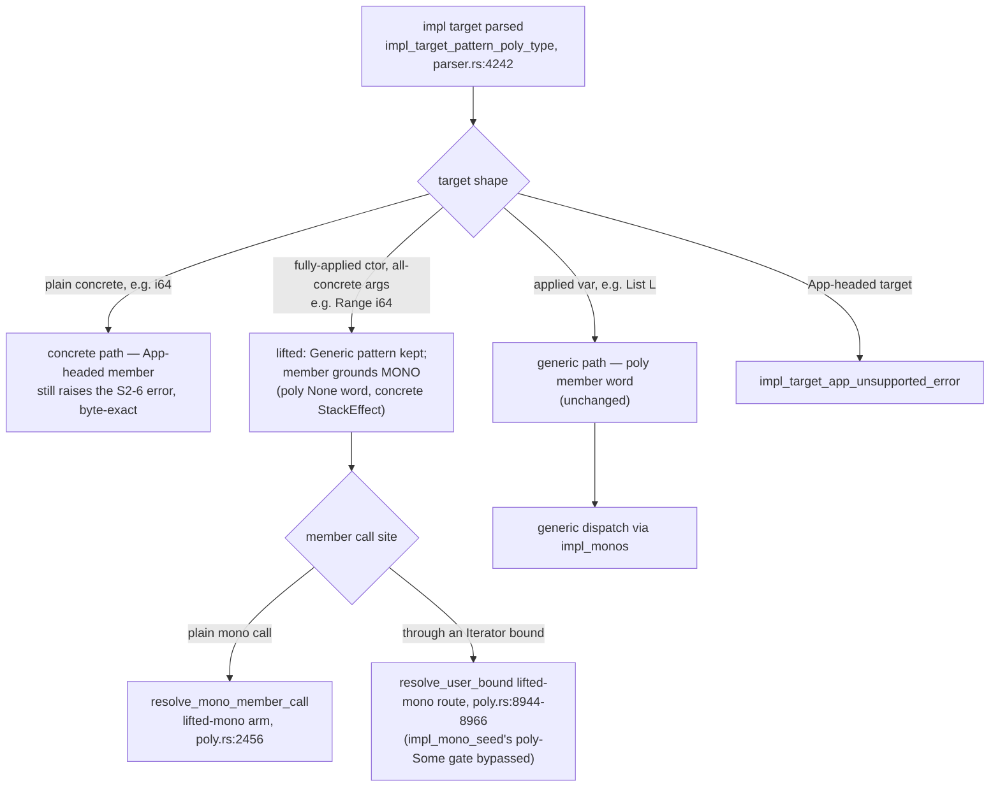

# Spec: P7b.S8 — Linear iterators (HKT as the associated-type substitute)

**Status:** Implemented (commit range `86ca5eb..1c54b5a`, branch `p7b-s8`)
**Created:** 2026-09-06
**Discovery:** [slice8-brief](./slice8-brief.md) (rulings R1–R4 + the S8b carve-out, decided
260905 — settled, do not reopen) and the verbatim probe log [slice8-probes](./slice8-probes.md)
(round P8, four workers, P8-1..P8-6). Roadmap entry:
[P7b-higher-kinded-types.md](../P7b-higher-kinded-types.md), section "P7b.S8".
**Phases:** `c6b9afc` (gate lift + protocol + List impl) → `b5b7ba4` (for_each/fold through the
bound) → `a10720c` (S2-6 lift, Range[i64] mono) → `1c54b5a` (IR evidence + written record), on
top of the reviewed spec `86ca5eb`.

## What was done and why

Sooth had container types and a working trait system (S2/S4/S6/S7) but no iteration protocol:
there was no way to write one generic `for_each` or `fold` that drains a `List` or a count-up
`Range` without hand-rolling a per-type recursive word. Associated types stay out of scope by
design — the roadmap's answer is to make the iterator itself the type constructor
(`trait: Iterator['It: * -> *] : next ( 'It['T] -- Step['T 'It['T]] ) ;`), with linearity *as*
the protocol: `next` consumes the iterator and yields element-plus-remainder packed in one
`Step` value, `drop` is the explicit destructor, and the exhausted case is exactly the question
of where the final drop lives. The probe round (P8, 260905) refuted the old "delta ≈ zero"
premise and located the two real blockers: the trait could not even be **declared** (the
member-row gate rejected every ctor-headed App), and a count-up `Range` had **no legal impl
target** (the S2-6 concrete-impl-target fence). S8 landed both compiler deltas plus the
protocol module, and the roadmap exit — `next`/`for_each`/`fold` through a bound over List and
Range goldens — is reached.

What it proved: the trait's own applied type variable substitutes for an associated type. One
bound-generic consumer pair, written once against neither impl, serves every impl; and member
dispatch through a bound over a ctor-headed compound return (the Step row) works unmodified —
the REQ-6 measurement, the slice's named risk (`poly_cross_call_unsupported_error`), passed
when measured in phase 2.

### The recorded rulings (R1–R4, 260905 — encoded, not reopened)

- **R1 — the Step row is the protocol.** `type: Step['T 'Rest] | Done | More 'T 'Rest ;`;
  `Done` carries nothing; the final drop lives inside `next`'s own `Done` arm — the one
  canonical site. The Option-shaped row (`next ( 'It['T] -- Option['T] 'It['T] )`) is the
  recorded rejected alternative: arm parity forces the dead iterator out to every caller and
  the final drop to every `None` path.
- **R2 — the S2-6 concrete-impl-target lift lands in S8**; `impl: Iterator for Range[i64]` is
  a golden. Landed as *design A*: the member grounds **monomorphically** (a `poly: None` word
  with a concrete `StackEffect`). D5 forces this: the borrow gate admits only `Concrete`
  aggregates as borrowable locals (`src/check/poly.rs:6656`), so a *poly*-bodied member over a
  `Generic`-pattern `Range[i64]` could never read `cur`. **Option B** — routing lifted targets
  through the existing generic path with a var-free fully-concrete grounded `PolySig`
  (`poly: Some`) — was the documented fallback and was **not needed**; it would have threaded
  today's dispatch/mint machinery unchanged but is a degenerate poly word. Representation
  matches semantics: the mono word plus the lifted-target dispatch arms are permanent,
  reusable infrastructure (S8b's traitful List members, any future ctor-spelled target) with
  diagnostics grounded in real concrete types.
- **R3 — the S6 construction wall stays.** The wall fix plus per-impl traitful `List` members
  (`map`, `append`) are carved out to **P7b.S8b**. No S8 shape needs the wall: `Done` carries
  nothing (the exhausted arm constructs no remainder) and `Range`'s `More` arm constructs
  plain scalar fields.
- **R4 — the consumers are `for_each` + `fold`** through the bound, written once. `map` is
  *not* in S8: a bound-generic body cannot produce `'It['U]` and cannot `dup` the abstract
  iterator (`poly_copy_generic_error`, `src/check/poly.rs`).

### The landed mechanism, in brief

- **Delta A — member-row gate lift (admission-shaped).** `member_shape_is_supported`
  (`src/parser.rs:389`) gained a `Generic` arm (`:428-431`): a ctor-headed application is
  supported when every one of its *type* arguments recursively is, and no `Len::Var` sits
  among its length arguments (the grounded `PolySig` takes `len_var_names` from the *target*,
  so a member's own dangling length variable would index out of bounds in the diagnostic
  renderer). Everything else stays rejected byte-exactly: plain-slot member-local-headed Apps
  (`'G['T]`), ctor rows containing one (`Step['G['T] 'F['T]]`), row-nested ones (`'G['U]`);
  nested `'F['G['T]]` member rows were legal before and stay legal.
- **Delta B — the S2-6 lift, impl-target path only.** `impl_target_pattern_poly_type`
  (`src/parser.rs:4242`) re-raises a fully-applied all-concrete ctor application that
  `raw_to_poly_type` folded to `Concrete` back into its `Generic` pattern — ctor identity
  preserved for diagnostics and dispatch; `raw_to_poly_type` itself is untouched, so ordinary
  signatures keep folding and sharing the S4-1 mint (pinned by
  `range_i64_in_an_ordinary_signature_still_folds_and_shares_the_mint`). The matcher needed
  nothing — `match_impl_target_rec`'s `Generic` arm already compared concrete-arg patterns
  argument-by-argument (OQ-1, answered by the code). The work was the *continuations*: a
  lifted-mono arm in `resolve_mono_member_call` (`src/check/poly.rs:2456` — fenced by the
  member word's own mono flag, so it covers exactly the words the desugar grounded) and a
  mono route in `resolve_user_bound` (the lifted-mono candidate branch `:8944-8966`, bare-symbol pick at the `if is_mono` at `:9057`) so a lifted target's mono member word
  dispatches at obligation sites instead of falling into `impl_mono_seed`'s `poly: Some`
  requirement (`:8020`).
- **The protocol module and the Range module.** `lib/core/iterator.sth` (78 lines) carries
  `Step`, the `Iterator` trait, the List impl, and the consumers; `lib/core/range.sth`
  (38 lines) carries `Range['T]` (real `cur`/`limit` fields, no phantoms) and its
  `impl: Iterator for Range[i64]`. The two-module split is a recorded phase-3 deviation from
  the original single-module plan — each core module owns its type, the trait module stays
  protocol-only — and exercises both orphan-rule arms: the trait-module arm for `List` in
  `iterator.sth`, the target-ctor-module arm for `Range` in `range.sth`
  (`src/check/declarations.rs:500-513`).
- **The consumers.** Self-recursive with the self-call in tail position, so the P7.S3g
  transform lowers the drain loop to one frame whose self-call is a back-edge; `next` remains
  its own, separately called, real monomorphized frame. The IR pin
  (`consuming_loop_over_range_is_one_frame_with_a_back_edge_and_next_is_a_real_frame`,
  captured via `emit_ssa_with_manifest`) holds the facts; `src/ir/` is diff-empty.

### Impl-target and member-shape routing after S8

### Review-discovered panic paths and their fences

Two panics were reachable after the gate lift, both from `ground_member_type`'s missing
`Generic` case (`_ => unreachable!`, `src/ast.rs:2209-2211` era); both found in the phase-1
review, both fenced and pinned:

1. A ctor-headed member row against a **concrete** impl target passed the old S2-6 fence
   (`member_ty_mentions_app` is false for an App-free `Generic`) and would reach the
   `unreachable!` via the concrete branch — fenced parser-side by
   `fence_member_ctor_application_against_concrete_target` (`src/parser.rs:521`), a located,
   measured-then-pinned error
   (`ctor_headed_member_row_over_concrete_impl_target_is_located_not_a_panic`).
2. `unsatisfied_user_bound_error` renders member signatures through `try_ground_member_type`,
   whose fallthrough handed a `Generic` to the same `unreachable!` — live the moment a bound
   over a trait with a ctor-headed member row is instantiated at a type with no impl (it
   fired on the shipped `core::iterator` itself). Fenced with a defensive
   `PolyType::Generic { .. } => None` arm (`src/ast.rs:2312`), so the existing missing-impl
   diagnostic fires
   (`bound_over_ctor_headed_member_trait_at_unimplemented_{hkt,concrete}_type_is_located_not_a_panic`).

Phase-3 review findings, fixed in `a10720c` and pinned: (1) a variable-free quotation slot in
a lifted-target member's grounded signature reached `ground_var_free`'s field-shape router
(`unreachable!`) — a `PolyType::Quotation` arm recursing into the rows, honoring `is_inline`,
was added (`src/ast.rs:1009`); an inline-quotation parameter then reaches the ordinary
`declares_inline` diagnostic rather than building. (2a) `ground_into_word_scoped_registries`
matches on target-pattern shape alone, so lifted ctor targets now fall into an arm previously
only for applied-var targets — measured safe (`CtorImage` carries only the ctor header's
identity), documented at `src/check/poly.rs:567` rather than fenced. Also pinned: an HKT
member local identified with a target slot grounds mono and reaches an ordinary mono type
error; an unidentified one still raises the S2-6 fence.

### The measured import surface (resolved, phase-1 review, verified end-to-end)

A consumer imports the trait, its type, and its ctors —
`import: core::iterator | Step Done More Iterator | ;` — and does **not** name the member:
member names resolve through trait dispatch, not module exports (`export: ... next` promises
nothing; the synthesized member word is always mangled). Naming `next` in the import list
errors; omitting the import errors `unknown word next`. `for_each`/`fold` are ordinary
exported words imported by name; a consumer that only *calls* them needs nothing else, while
one that writes its own `Step?` arms or `Iterator`-bounded words needs the
`Step Done More Iterator` surface.

### The `fold` name collision (known follow-up, deliberately not addressed)

`core::iterator`'s `fold` and `core::combinators`' array `fold` share the bare name. A
consumer wildcard-importing both gets a fails-closed duplicate-binding error at the import
site, not a silent shadow. Left for a future slice to settle a disambiguation convention (an
alias import, or a rename).

## Deliberate limitations and non-goals

- **P7b.S8b (decided 260905):** the S6 construction-wall fix
  (`poly_bind_construction_arg`'s bare-`Generic` `^Self['T]` self-reference-field arm —
  verified diff-empty in this slice's range) plus per-impl traitful `List` members (`map`,
  `append`) over the Iterator protocol.
- Associated types / GATs — the slice exists to show they are not needed.
- Borrow-based iteration (`&!`, lifetimes, exclusivity) — linearity replaces it.
- No adaptor library (`zip`/`take`/`rev`/...), no lazy/streaming iteration;
  `Iterator for array` is P7b.S6d territory; `Option`'s shape and surface consumed as-is.
- Fusion is **evidence, then a measured ruling (260907)**: the roadmap records the facts (the loop is one frame;
  `next` is a real called frame; a two-consumer chain is two dedicated frames — "one frame" is
  true of the loop, not of loop-plus-`next`) and the P8-F probe numbers: call-fusion would recover
  ~16% of the protocol's per-element cost (the dominant ~62% is the Step-value protocol); on
  embedded it trades flash size for a small cycle win. Ruled: deferred, reopen on measured need
  (the high-leverage lever is streaming fusion, not call fusion).
- The D5 borrow gate untouched; no numeric trait; no phantom parameters; `src/ir/`
  diff-empty; the QBE backend untouched.

## Implementation

- **Phase 1 — gate lift + protocol + List impl (`c6b9afc`)**: `src/parser.rs`
  (`member_shape_is_supported` `Generic` arm `:428-431` with unit tests;
  `member_first_ctor_application` `:476` and `fence_member_ctor_application_against_concrete_target`
  `:521` — panic fence 1); `src/ast.rs` (`try_ground_member_type` `Generic => None` `:2312` —
  panic fence 2); `lib/core/iterator.sth` (`Step`, `Iterator`, List `next`, exports);
  `lib/core/sooth.pkg` (module list); `tests/phase7b_slice8.rs` (gate pins, admission-safety
  sweep, cross-module-impl drain).
- **Phase 2 — for_each/fold through the bound (`b5b7ba4`)**: `lib/core/iterator.sth` (the
  consumers, self-call in tail position); `tests/phase7b_slice8.rs` (List drain/sum goldens,
  the linearity-teeth pin — an undropped `Step` shell across dispatch arms is a compile
  error; REQ-6 bound dispatch measured and passing).
- **Phase 3 — S2-6 lift, Range[i64] mono (`a10720c`)**: `src/parser.rs`
  (`impl_target_pattern_poly_type` `:4242` interception, impl-target-path only;
  `ground_mono_member_slots` `:4421`; the mint-sharing regression pin); `src/ast.rs`
  (`ImplTarget::is_mono_ctor_app` `:2569`, `ground_var_free` `:1191`,
  `poly_type_is_var_free` `:2174`, review finding 1's Quotation arm `:1009`);
  `src/check/poly.rs` (`resolve_mono_member_call` lifted-mono arm `:2456`;
  `resolve_user_bound` mono route `:8944-8966`; finding-2a doc `:567`); `lib/core/range.sth` +
  `sooth.pkg` registration; `tests/phase7b_slice8.rs` (Range mono golden, byte-exact fence
  pins, generic-path pin, quotation-slot and HKT-local pins).
- **Phase 4 — evidence + written record (`1c54b5a`)**: the IR pin in
  `tests/phase7b_slice8.rs`; the `P7b-higher-kinded-types.md` S8 entry (exhausted-case ruling,
  fusion evidence, exit wording, spec link, growth re-check, fold-collision note);
  `ROADMAP.md` touch-up.

**Verification (checked at condensation time, 2026-09-06):** full gate green on `1c54b5a` —
`cargo fmt --check` clean; `cargo clippy -- -D warnings` clean; `cargo test` 3286 passed /
0 failed across 87 test binaries, including `tests/phase7b_slice8.rs` 24/24 (the new S8
goldens, the byte-exact diagnostic pins, both panic-path fences, and the IR pin). The
shipped branch tip additionally carries the merge of main (P7b.S6c, `7ec6c44`); the full
gate is green on the merged tree (88 test binaries — the +1 is S6c's
`tests/phase7_slice6c.rs`), and an integrated-state review verified the S6c interaction
semantically clean (no shared function edited by both slices). The range
diff `86ca5eb..1c54b5a` contains no `src/ir/` change and leaves the S6 wall
(`poly_bind_construction_arg`) untouched; the wall witness
(`tests/phase7b_slice6.rs:410`, `monoid_for_list_append_construction_wall_is_recorded`) is
green. Growth re-check (CLAUDE.md, phase-4 exit) recorded in the roadmap entry:
`iterator.sth` and `range.sth` are each one cohesive thing, and `range.sth`'s separation from
the original single-module plan is itself the split the convention asks for.
